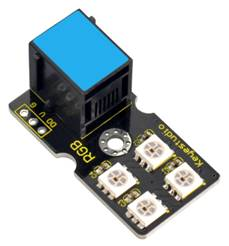
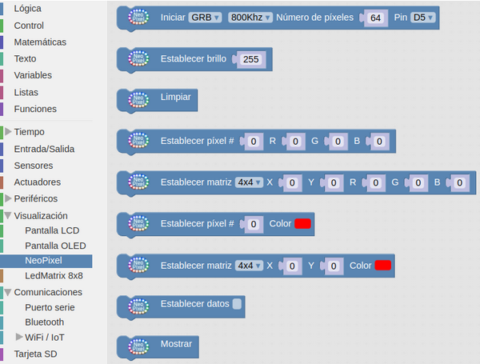
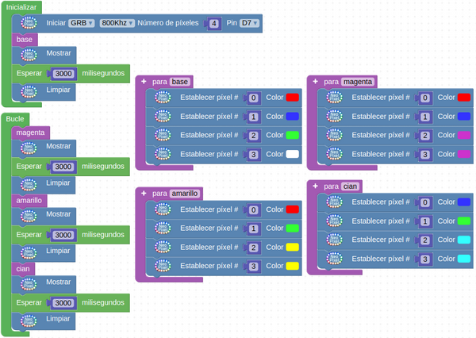
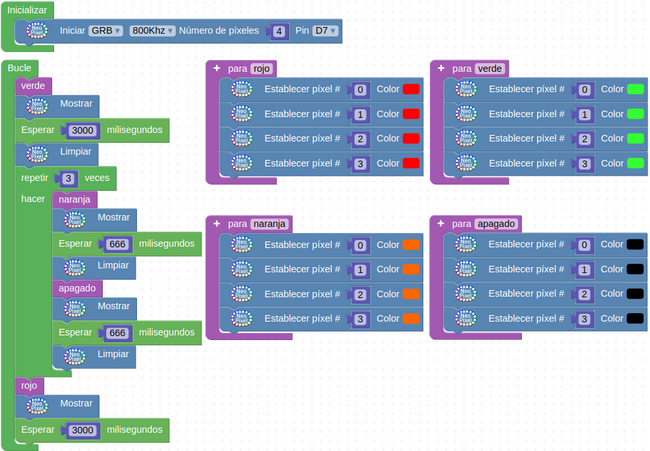

# A37-Módulo LED RGB con 4 LEDs Neopixel WS2812
¿Que es Neopixel? Neopixel es una marca creada por Adafruit Industries para referirse a algunos LEDs RGB que son direccionables individualmente, es decir LEDs que cuentan con un circuito lógico integrado dentro de si mismos, y este circuito es el que hace posible controlar con un solo pin digital el color de cada LED en una secuencia de LEDs encadenados en tiras, círculos o matrices. No todos los LEDs que son direccionables individualmente son Neopixel, solo lo son los basados en alguno de estos controladores: WS2812, WS2811 o SK6812. 
Cada LED cuenta con los siguientes 4 pines:

* GND
* 5V – Vcc
* DIN – Pin que recibe la información del color
* DO – Pin que entrega la información del color

El módulo RGB basado en 2812 es una matriz de 2x2 formada por diodos LED 5050 y la circuitería necesaria para ser direccionados. Se sincronizan gracias al oscilador interno de alta precisión de que disponen. Cada uno de los LEDs tiene una “dirección única” y es RGB, siendo todo gestionado por un solo cable de datos y el controlador integrado en el mismo elemento.
Sus principales características son:

* Potencia: 100 mW
* Fuente de luz: LEDs RGB 5050 SMD
* Modelo de circuito integrado: 4 x WS2812
* Niveles de gris: 256
* Ángulo de iluminación: 180°

Su aspecto lo vemos en la Figura A37.1.

*Figura A37.1. Aspecto*

En el apartado de bloques de programación, se encuentra en "Visualización" (Figura A37.2) y tiene su propio grupo de bloques.

*Figura A37.2. Bloques*

## **Práctica A37.1**
Vamos a poner en funcionamiento el módulo matriz de 2x2 haciendo un test de colores.

* Haremos un programa que realice un test de los cuatro diodos LED. El programa lo tenemos en la Figura A37.3.

*Figura A37.3. Solución A37.1*

## **Práctica A37.2**
Una práctica de semáforos con la matriz de 2x2.

* Haremos un semáforo sencillo que permanentemente cambie el color entre los tres habituales. El programa lo tenemos en la Figura A37.4.

*Figura A37.4. Solución A37.2*

