# A05-Sensor LDR
En esta práctica aprenderemos a programar el sensor de instensidad de luz o cómo se llama en ArduinoBlocks: 'Nivel de LUZ (LDR)'. Este sensor es necesario conectarlo a un puerto analógico.
El sensor 'Nivel de LUZ (LDR)', también llamado fotocélula, es muy común en nuestra vida cotidiana. Por ejemplo, cuando se encienden las farolas por la noche, las luces solares de jardín, los detectores de dinero, ...

Es un sensor analógico que obtiene valores de tensión entre 0 y 5V y nos los convierte en numéricos entre 0 y 1023. El sensor tiene el aspecto que vemos en la Figura A05.1.

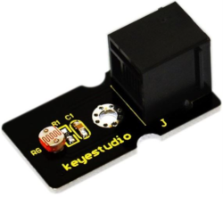

*Figura A05.1. Aspecto sensor LDR*

En el apartado de bloques de programación, se encuentra en "Sensores", como vemos en la Figura A05.2.

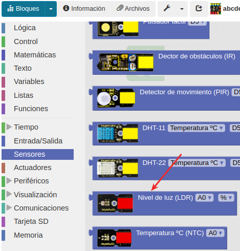

*Figura A05.2. Bloque sensor LDR*

## **Práctica A05.1**
Antes de empezar la programación, necesitamos conocer qué valores marca el sensor en el lugar en el que trabajamos. Es decir, no podemos programar sin conocer el % de intensidad de luz que tenemos en nuestro entorno. Una vez obtenido este valor, podremos empezar las programaciones más complejas. Así pues, lo primero que haremos es un programa para:

* Ver en la consola el % de intensidad de luz cada 3 segundos. En la Figura A05.3 vemos el programa.

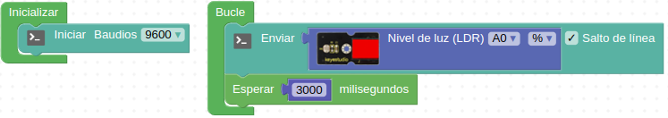

*Figura A05.3. Solución A05.1*

## **Práctica A05.2**
Para realizar esta segunda práctica, necesitamos conocer el bloque de programación que nos permite igualar o comparar si un número es mayor o menor que otro. Además, utilizaremos el bloque que  nos permite escribir números. En la Figura A05.4 vemos los diferentes bloques de programación.

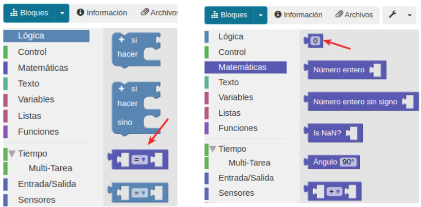

*Figura A05.4. Bloques*

* Si la intensidad de luz es superior a un valor X (tomar como referencia el medido en la práctica anterior) que en la consola aparezca "Claro". En la Figura A05.5 vemos el programa.

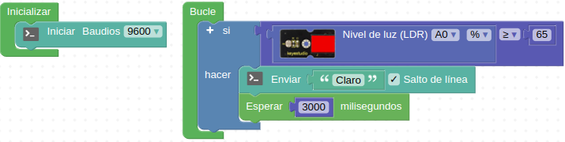

*Figura A05.5. Solución A05.2*

## **Práctica A05.3**

* Si la intensidad de luz es superior a un valor X, en nuestro caso 65%, que la consola escriba "Claro". Sin embargo, si es inferior al valor anterior, que la consola escriba "Oscuro".

Hay dos formas de programarlo, la primera necesitas especificar qué condición debe suceder para que la consola escriba "Oscuro". En la Figura A05.6 vemos el programa.

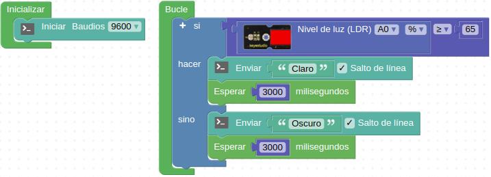

*Figura A05.6. Solución A05.3*

En la segunda forma se entiende que todo lo que no sea la primera condición será la segunda. En la Figura A05.7 vemos el programa.

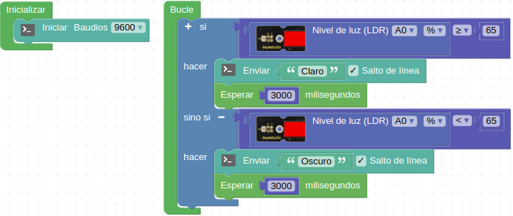

*Figura A05.7. Solución A05.3*

Hemos cambiado el bloque “si … hacer” por el bloque “si … hacer … sino”

## **Práctica A05.4**
En esta práctica volveremos a trabajar con las variables. Las variables son elementos comunes en programación. Cuando creamos una variable estamos dando un nombre a un dato o una lectura. Por ejemplo, cuando el sensor de intensidad de la luz detecta el porcentaje de luz de la habitación, toda la medida de los diferentes valores podemos agruparlos con la variable nombrada "Intensidad de luz". No es obligatorio utilizar variables, pero es una forma mucho más cómoda y comprensible de crear nuestros programas.

Para crear una nueva variable, debemos ir al apartado de variables y establecer una del tipo que necesitemos. Es decir, asignaremos un nombre a un conjunto de valores comunes. Cuando no tenemos ninguna variable creada en nuestro programa el aspecto que muestra el menú 'Variables' lo vemos en la Figura A05.8.

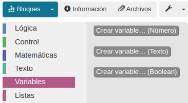

*Figura A05.8. Menú variables*

En la Figura A05.9 vemos como cambia el menú cuando creamos una de tipo número llamada “Intensidad de luz”.

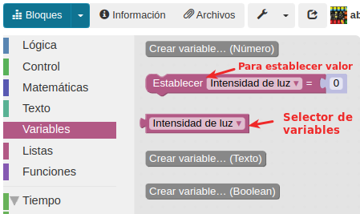

*Figura A05.9. Menú variables con una variable creada*

Si necesitamos renombrar o eliminar una variable debemos mostrar el desplegable del bloque “Establecer valor” y escoger la opción que corresponda a nuestro caso (Figura 
A05.10). Para poder hacer esto debemos tener el bloque en la zona de programa.

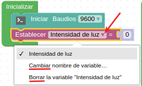

*Figura A05.10. Renombrar o borrar variable*

Es necesario establecer el valor de la variable en el bucle, y asociarla a un sensor que pueda agruparnos los valores. Lo habitual y recomendable en programación es definir e inicializar las variables a “0” o a un valor que nos interesa en el bloque “Inicializar” y en “Bucle” trabajar con ellas, tal y como vemos en la Figura A05.11.

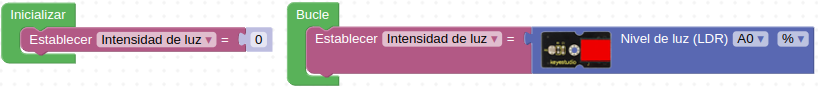

*Figura A05.11. Inicializar y asignar valor a variable*

Repetiremos los mismos ejercicios que las prácticas anteriores pero utilizando la variable en lugar del bloque del sensor.

* Envía a la consola el % de intensidad de luz cada 3 segundos. En la consola debe aparecer escrito de la siguiente manera: Intensidad luz: XX,XX. Para ello, vamos a utilizar un nuevo bloque el que encontramos en el menú "Texto" llamado 'Crear texto con que vemos en la Figura A05.12, donde también vemos el programa y el resultado en la Consola.

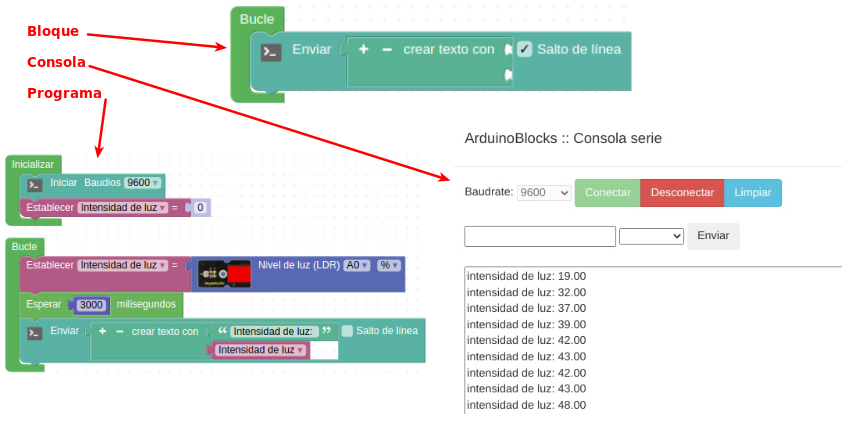

*Figura A05.12. Solución A05.4*

## **Práctica A05.5**
En este último proyecto utilizando el sensor de luz, imitaremos qué ocurre cuando por la noche las farolas de la calle se encienden. Por tanto, utilizaremos un LED y el sensor LDR.

* Ejemplifica lo que sucede por la noche con las farolas de la calle. Es decir, cuando la intensidad de la luz sea inferior o igual a un 5%, que el LED se encienda. Por el contrario, cuando sea superior al 5%, el LED se apaga. El programa lo vemos en la Figura A05.13.

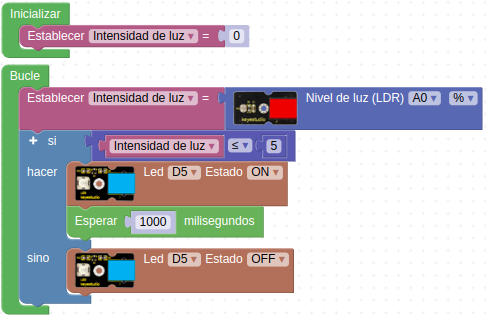

*Figura A05.13. Solución A05.5*

