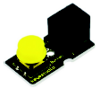
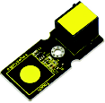
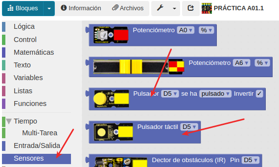
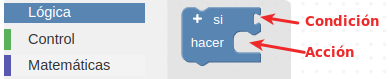
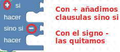
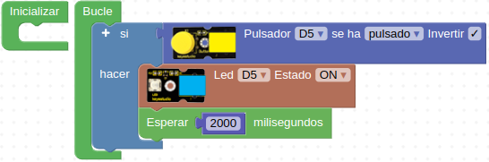
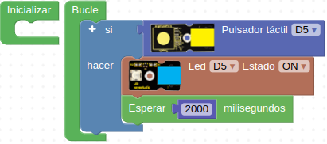
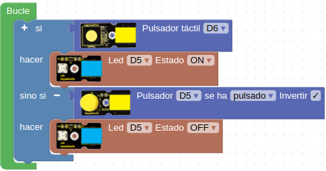

# A03 - Control de encendido y apagado de un LED con un pulsador
Continuando con el uso de LED, en las siguientes prácticas lo combinaremos con dos pulsadores: el táctil y el pulsador normal que vemos en las Figuras A03.1 y A03.2 respectivamente.

*Figura A03.1. Pulsador*

El pulsador es un sensor digital, que tiene dos estados. Cuando se presiona el botón, emite una señal de nivel alto, es decir, 5V. En cambio, cuando se suelta el botón, emite una señal de nivel bajo: 0V.

*Figura A03.2. Pulsador táctil*

El pulsador táctil es un sensor táctil, tal y como explica su nombre puede "sentir" el tacto de forma muy sensible y funciona de la misma forma que el pulsador de botón.

Los dos pulsadores son sensores, por tanto, los encontraremos en el apartado "Sensores". En el momento de la programación es muy importante tener en cuenta a qué puerto los hemos conectado. Siempre se conectan a los puertos digitales, pero es necesario programar el número correcto. En la Figura A03.3 vemos los bloques de ambos pulsadores.

*Figura A03.3. Bloques pulsadores*

También empezaremos a hacer uso de las funciones de "Lógica", como la condicional: "si… hacer". Este bloque de programación es uno de los pilares fundamentales en el mundo de la programación, puesto que permite evaluar estados, y según la condición, programar acciones, es decir tomar decisiones. En la Figura A03.4 vemos este bloque.

*Figura A03.4. Bloque si… hacer*

En el apartado de condiciones se pueden introducir factores como: estado de los sensores, comparaciones, igualdades, operaciones matemáticas. En cambio, en el apartado de acciones, podemos programar: encender un LED, enviar mensajes a la consola, escribir algo en alguna pantalla externa, etc.

También, se puede ampliar el bloque con más condicionales haciendo clic en el símbolo “+” y quitarlos con el signo “-”, como vemos en la Figura A03.5.

*Figura A03.5. Ampliar o reducir el bloque si… hacer*

## **Práctica A03.1**

• Si hacemos clic en el pulsador el LED se enciende durante 2 segundos. El programa lo vemos en la Figura A03.6.

*Figura A03.6. Programa pulsador mas LED*

## **Práctica A03.2**

• Si hacemos clic en el pulsador táctil el LED se enciende durante 2 segundos. El programa lo vemos en la Figura A03.7.

*Figura A03.7. Programa pulsador táctil mas LED*

## **Práctica A03.3**

• Si hacemos clic en el pulsador táctil se enciende el LED. Sin embargo, si hacemos clic en el otro pulsador, se apaga. El programa lo vemos en la Figura A03.8.

*Figura A03.8. Programa con dos pulsadores mas LED*

