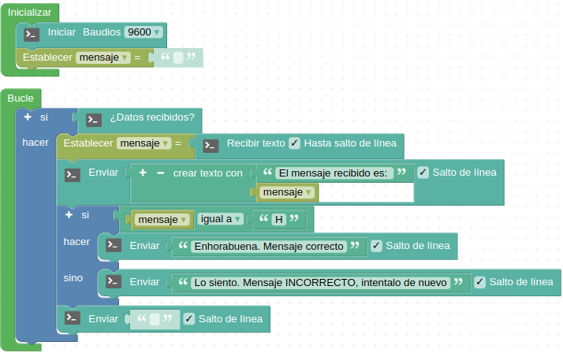

# Saludo por consola si se recibe desde el PC "H"
* **Enunciado:**

Prueba de comunicación entre nuestra placa Easy Plug y el ordenador a través de la consola serie. Implementar un programa que establezca las condiciones para que al recibir la placa EP el carácter 'H' enviado desde la consola nos responda con un mensaje en la misma consola.

* **Material necesario:**
Todo corresponde al EASY PLUG Starter Kit [KS0158](https://wiki.keyestudio.com/Ks0158_Keyestudio_EASY_plug_starter_kit_for_Arduino)
  
    > 1 - Placa Easy Plug ([Ks0240](https://wiki.keyestudio.com/Ks0240_keyestudio_EASY_plug_Control_Board_V2.0))
    >
    > 1 - Cable USB (Incluido con la placa)

* **Solución gráfica:**

* **Solución para importar .abp:**

[Enlace al programa EP-R01.abp](./retos/EP-R01.abp)

