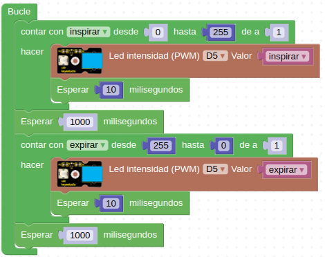

# R02-Respiración
* **Enunciado:**

Un LED aumenta su luminosidad poco a poco (inspira) con esperas de 10ms entre cada cambio, se queda totalmente encendido durante un segundo y luego se atenúa gradualmente (expira) de la misma forma quedando totalmente apagado un segundo y comienza la secuencia de nuevo. Es una simulación que hace parecer que el LED está respirando.

* **Material necesario:**
Todo corresponde al EASY PLUG Starter Kit [KS0158](https://wiki.keyestudio.com/Ks0158_Keyestudio_EASY_plug_starter_kit_for_Arduino)
  
    > 1 - Placa Easy Plug ([Ks0240](https://wiki.keyestudio.com/Ks0240_keyestudio_EASY_plug_Control_Board_V2.0))
    >
    > 1 - Cable USB (Incluido con la placa)
    >
    > 1 - Cable Easy Plug
    >
    > 1 - Módulo con diodo LED blanco ([Ks0100](https://wiki.keyestudio.com/Ks0100_keyestudio_EASY_plug_White_LED_Module))

* **Solución gráfica:**

* **Enlace para importar desde ArduinoBlocks:**

[Enlace al programa en ArduinoBlocks de EP-R03](http://www.arduinoblocks.com/web/project/924641)

* **Solución para importar .abp:**

[Enlace al programa EP-R03.abp](./retos/EP-R03.abp)

