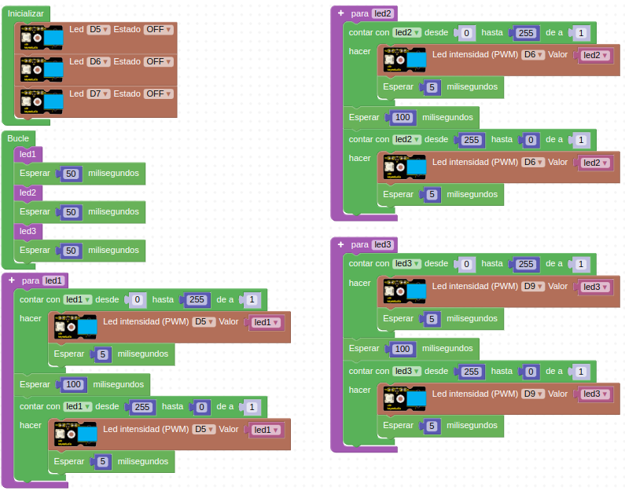

# R04-Luz que fluye
* **Enunciado:**

Aprovechando lo visto en el reto 3 vamos a hacer que esa secuencia se reproduzca en tres LEDs, es decir, un LED aumenta su luminosidad poco a poco con esperas de 5ms entre cada cambio, se queda totalmente encendido durante 100ms y luego se atenúa gradualmente de la misma forma quedando totalmente apagado durante 50ms, ahora comienza un segundo LED a hacer lo mismo y cuando finalice lo hará un tercero y al finalizar este empieza otra ver el primero. Hacemos como si la luz fluyese de un LED a otro.

* **Material necesario:**
Todo corresponde al EASY PLUG Starter Kit [KS0158](https://wiki.keyestudio.com/Ks0158_Keyestudio_EASY_plug_starter_kit_for_Arduino)
  
    > 1 - Placa Easy Plug ([Ks0240](https://wiki.keyestudio.com/Ks0240_keyestudio_EASY_plug_Control_Board_V2.0))
    >
    > 1 - Cable USB (Incluido con la placa)
    >
    > 3 - Cable Easy Plug
    >
    > 3 - Módulo con diodo LED blanco ([Ks0100](https://wiki.keyestudio.com/Ks0100_keyestudio_EASY_plug_White_LED_Module))

* **Solución gráfica:**

* **Enlace para importar desde ArduinoBlocks:**

[Enlace al programa en ArduinoBlocks de EP-R04](http://www.arduinoblocks.com/web/project/924679)

* **Solución para importar .abp:**

[Enlace al programa EP-R04.abp](./retos/EP-R04.abp)

