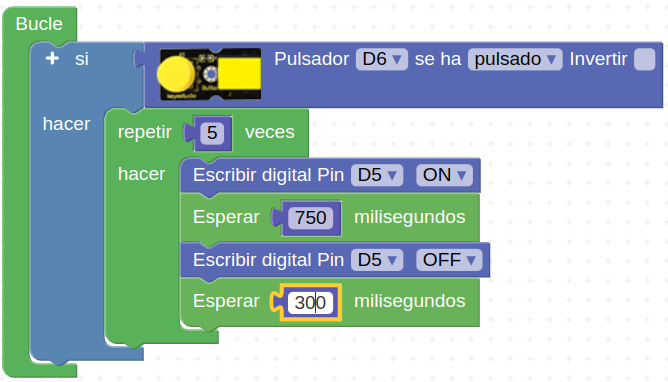

# R04-Luz que fluye
* **Enunciado:**

Vamos a hacer que cuando accionemos un pulsador se reproduzca un sonido en el zumbador activo que estará activo durante 750ms y sin sonar durante 300ms. Haremos que el sonido se repita cinco veces cada vez que pulsemos.

* **Material necesario:**
Todo corresponde al EASY PLUG Starter Kit [KS0158](https://wiki.keyestudio.com/Ks0158_Keyestudio_EASY_plug_starter_kit_for_Arduino)
  
    > 1 - Placa Easy Plug ([Ks0240](https://wiki.keyestudio.com/Ks0240_keyestudio_EASY_plug_Control_Board_V2.0))
    >
    > 1 - Cable USB (Incluido con la placa)
    >
    > 2 - Cable Easy Plug
    >
    > 1 - Módulo buzzer activo ([Ks0102](https://wiki.keyestudio.com/Ks0102_keyestudio_EASY_plug_Active_Buzzer_Module))
    >
    > 1 - Módulo pulsador ([Ks0112](https://wiki.keyestudio.com/index.php/Ks0112_keyestudio_EASY_plug_Digital_Push_Button))

* **Solución gráfica:**

* **Solución para importar .abp:**

[Enlace al programa EP-R05.abp](./retos/EP-R05.abp)

