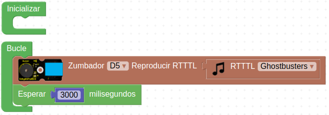

# R06-Quien canta
* **Enunciado:**

Haremos que el zumbador reproduzca una conocida melodía cada 3 segundos para ver si es reconocida.

* **Material necesario:**
Todo corresponde al EASY PLUG Starter Kit [KS0158](https://wiki.keyestudio.com/Ks0158_Keyestudio_EASY_plug_starter_kit_for_Arduino)
  
    > 1 - Placa Easy Plug ([Ks0240](https://wiki.keyestudio.com/Ks0240_keyestudio_EASY_plug_Control_Board_V2.0))
    >
    > 1 - Cable USB (Incluido con la placa)
    >
    > 1 - Cable Easy Plug
    >
    > 1 - Módulo buzzer pasivo ([Ks0103](https://wiki.keyestudio.com/index.php/Ks0103_keyestudio_EASY_plug_Passive_Buzzer_Module))

* **Solución gráfica:**

* **Solución para importar .abp:**

[Enlace al programa EP-R06.abp](./retos/EP-R06.abp)

