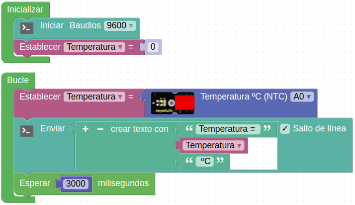

# R07-Termómetro al revés
* **Enunciado:**

Vamos a medir la temperatura con el "Sensor analógico de temperatura" que en realidad está basado en un dispositivo denominado termistor. Ya en el propio bloque de programación pone unas siglas, NTC que significan 'Coeficiente Negativo de Temperatura' y en la práctica lo que ocurre es que el termistor disminuye su resistencia cuando aumenta la temperatura por lo que el valor analógico que entrega tiene ese comportamiento.

* **Material necesario:**
Todo corresponde al EASY PLUG Starter Kit [KS0158](https://wiki.keyestudio.com/Ks0158_Keyestudio_EASY_plug_starter_kit_for_Arduino)
  
    > 1 - Placa Easy Plug ([Ks0240](https://wiki.keyestudio.com/Ks0240_keyestudio_EASY_plug_Control_Board_V2.0))
    >
    > 1 - Cable USB (Incluido con la placa)
    >
    > 1 - Cable Easy Plug
    >
    > 1 - Sensor analógico de temperatura ([Ks0104](https://wiki.keyestudio.com/Ks0104_keyestudio_EASY_plug_Analog_Temperature_Sensor))

* **Solución gráfica:**

* **Enlace para importar desde ArduinoBlocks:**

[Enlace al programa en ArduinoBlocks de EP-R07](http://www.arduinoblocks.com/web/project/925731)

* **Solución para importar .abp:**

[Enlace al programa EP-R07.abp](./retos/EP-R07.abp)

