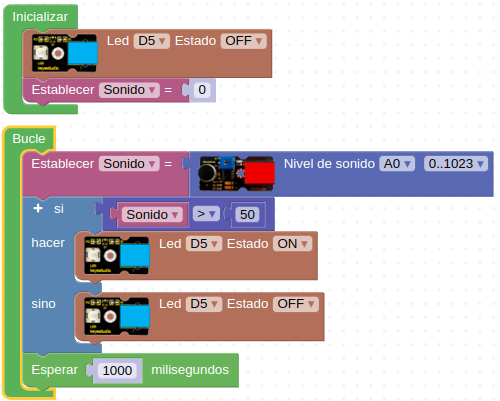

# R08-Al aplaudir se enciende una luz
* **Enunciado:**

Se trata de hacer una lámpara controlada por sonido de forma que cuando el sonido ambiente supere un determinado nivel esta se encienda y si no lo supera que permanezca apagada.

* **Material necesario:**
Todo corresponde al EASY PLUG Starter Kit [KS0158](https://wiki.keyestudio.com/Ks0158_Keyestudio_EASY_plug_starter_kit_for_Arduino)
  
    > 1 - Placa Easy Plug ([Ks0240](https://wiki.keyestudio.com/Ks0240_keyestudio_EASY_plug_Control_Board_V2.0))
    >
    > 1 - Cable USB (Incluido con la placa)
    >
    > 2 - Cable Easy Plug
    >
    > 1 - Módulo con diodo LED blanco ([Ks0100](https://wiki.keyestudio.com/Ks0100_keyestudio_EASY_plug_White_LED_Module))
    >
    > 1 - Sensor analógico de sonido ([Ks0105](https://wiki.keyestudio.com/Ks0105_keyestudio_EASY_plug_Analog_Sound_Sensor))

* **Solución gráfica:**

* **Solución para importar .abp:**

[Enlace al programa EP-R08.abp](./retos/EP-R08.abp)

