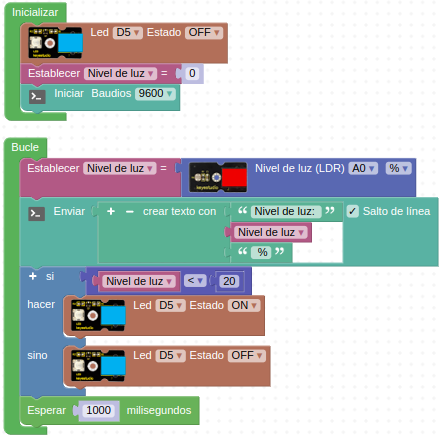

# R09-Farola automática
* **Enunciado:**

Se trata de hacer la imitación del encendido automático de una farola según el nivel de luz solar existente. Nos ayudaremos del monitor serie para saber las condiciones de iluminación del lugar donde vamos a probar el reto.

* **Material necesario:**
Todo corresponde al EASY PLUG Starter Kit [KS0158](https://wiki.keyestudio.com/Ks0158_Keyestudio_EASY_plug_starter_kit_for_Arduino)
  
    > 1 - Placa Easy Plug ([Ks0240](https://wiki.keyestudio.com/Ks0240_keyestudio_EASY_plug_Control_Board_V2.0))
    >
    > 1 - Cable USB (Incluido con la placa)
    >
    > 2 - Cable Easy Plug
    >
    > 1 - Módulo con diodo LED blanco ([Ks0100](https://wiki.keyestudio.com/Ks0100_keyestudio_EASY_plug_White_LED_Module))
    >
    > 1 - Fotocélula o LDR ([Ks0106](https://wiki.keyestudio.com/Ks0106_keyestudio_EASY_plug_Photocell_Sensor))

* **Solución gráfica:**

* **Solución para importar .abp:**

[Enlace al programa EP-R09.abp](./retos/EP-R09.abp)

