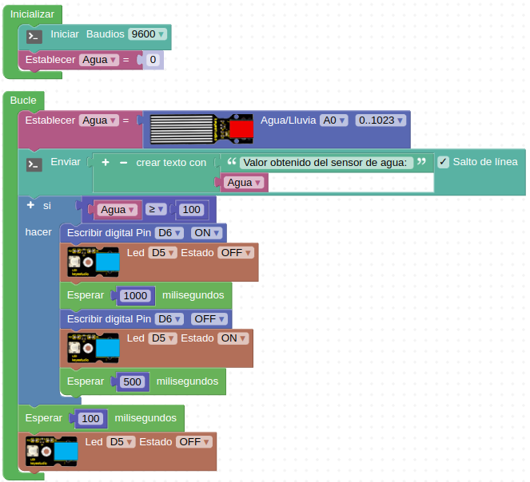

# R10-Escape de agua
* **Enunciado:**

Se trata de crear una alarma óptico-acústica que nos informe que hay agua en el suelo donde está colocada la lavadora, el lavavajillas o cualquier elemento que nosotros necesitemos. Nos ayudamos de la consola serie para saber los valores que envía el sensor cuando está seco (debería ser 0) o cuando está en contacto con agua.

* **Material necesario:**
Todo corresponde al EASY PLUG Starter Kit [KS0158](https://wiki.keyestudio.com/Ks0158_Keyestudio_EASY_plug_starter_kit_for_Arduino)
  
    > 1 - Placa Easy Plug ([Ks0240](https://wiki.keyestudio.com/Ks0240_keyestudio_EASY_plug_Control_Board_V2.0))
    >
    > 1 - Cable USB (Incluido con la placa)
    >
    > 3 - Cable Easy Plug
    >
    > 1 - Módulo buzzer activo ([Ks0102](https://wiki.keyestudio.com/Ks0102_keyestudio_EASY_plug_Active_Buzzer_Module))
    >
    > 1 - Módulo con diodo LED blanco ([Ks0100](https://wiki.keyestudio.com/Ks0100_keyestudio_EASY_plug_White_LED_Module))
    >
    > 1 - Sensor de agua ([Ks0107](https://wiki.keyestudio.com/Ks0107_keyestudio_EASY_plug_Water_Sensor))

* **Solución gráfica:**

* **Solución para importar .abp:**

[Enlace al programa EP-R10.abp](./retos/EP-R10.abp)

