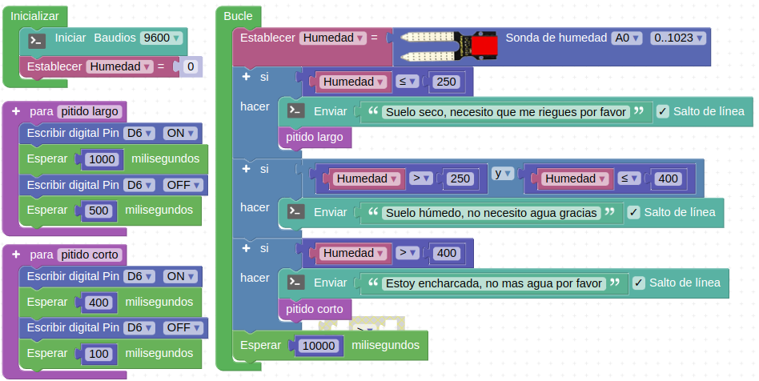

# R11-La planta sedienta
* **Enunciado:**

Crear un programa que nos muestre en la consola serie los mensajes indicados para las condiciones que se exponen a continuación.

* Si la humedad del suelo es ≤250 el mensaje será: "Suelo seco, necesito que me riegues por favor" y sonará el zumbador con un pitido largo.
* Si la humedad está entre 251 y 400 el mensaje será: "Suelo húmedo, no necesito agua gracias".
* Si la humedad es superior a 400 el mensaje será: "Estoy encharcada, no mas agua por favor" y sonará el zumbador con un sonido diferente con un pitido corto.

* **Material necesario:**
Todo corresponde al EASY PLUG Starter Kit [KS0158](https://wiki.keyestudio.com/Ks0158_Keyestudio_EASY_plug_starter_kit_for_Arduino)
  
    > 1 - Placa Easy Plug ([Ks0240](https://wiki.keyestudio.com/Ks0240_keyestudio_EASY_plug_Control_Board_V2.0))
    >
    > 1 - Cable USB (Incluido con la placa)
    >
    > 2 - Cable Easy Plug
    >
    > 1 - Módulo buzzer activo ([Ks0102](https://wiki.keyestudio.com/Ks0102_keyestudio_EASY_plug_Active_Buzzer_Module))
    >
    > 1 - Sensor de humedad del suelo ([Ks0108](https://wiki.keyestudio.com/Ks0108_keyestudio_EASY_plug_Soil_Humidity_Sensor))

* **Solución gráfica:**

* **Solución para importar .abp:**

[Enlace al programa EP-R11.abp](./retos/EP-R11.abp)

