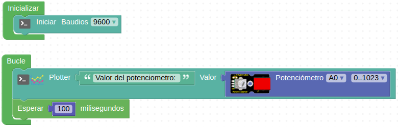

# R12-Veo datos
* **Enunciado:**

En esta ocasión vamos a mostrar de forma gráfica en el Serial Plotter el valor analógico leído del potenciómetro.

* **Material necesario:**
Todo corresponde al EASY PLUG Starter Kit [KS0158](https://wiki.keyestudio.com/Ks0158_Keyestudio_EASY_plug_starter_kit_for_Arduino)
  
    > 1 - Placa Easy Plug ([Ks0240](https://wiki.keyestudio.com/Ks0240_keyestudio_EASY_plug_Control_Board_V2.0))
    >
    > 1 - Cable USB (Incluido con la placa)
    >
    > 1 - Cable Easy Plug
    >
    > 1 - Módulo potenciómetro rotativo ([Ks0109](https://wiki.keyestudio.com/Ks0109_keyestudio_EASY_plug_Analog_Rotation_Sensor))

* **Solución gráfica:**

* **Solución para importar .abp:**

[Enlace al programa EP-R12.abp](./retos/EP-R12.abp)

