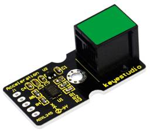
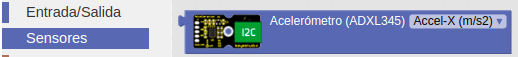
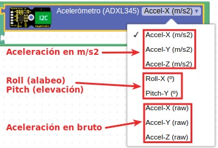
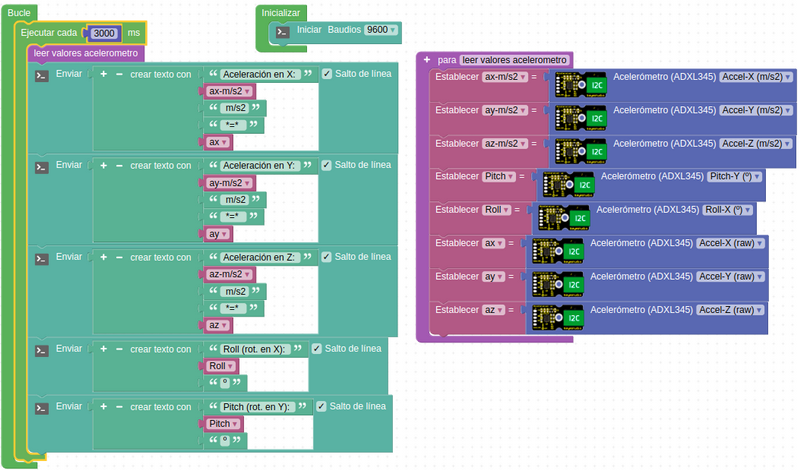
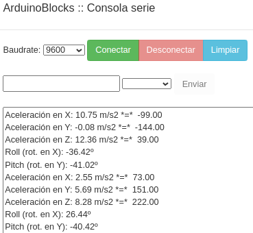
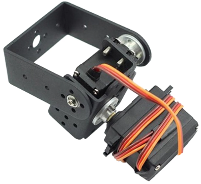
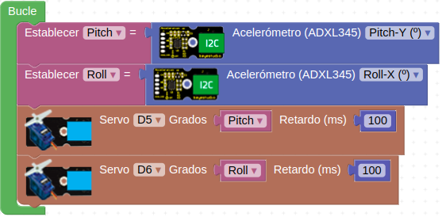

# A30-Acelerómetro de tres ejes ADXL345
El módulo ADXL345 es un acelerómetro MEMS (MicroelEctroMechanical Systems) o sistema microelectromecánico de 3 ejes con capacidad de medición de hasta ±16g de fuerza gravitacional.
Los datos de salida los entrega en formato digital en complemento a dos de 16 bits y se puede acceder a ellos a través de una interfaz digital I2C.

El ADXL345 es ideal para medir la aceleración estática de la gravedad en aplicaciones de detección de inclinación, así como la aceleración dinámica resultante del movimiento o impacto. Su aspecto lo vemos en la Figura A30.1.

*Figura A30.1. Aspecto*

En el apartado de bloques de programación, se encuentra en "Sensores" (Figura A30.2).

*Figura A30.2. Bloques*

Dispone de un solo bloque en el que se pueden seleccionar las opciones que vemos en la Figura A30.3.

*Figura A30.3. Opciones del bloque acelerómetro*

Los conceptos que vemos en la imagen se refieren a la rotación del eje X (Roll) y la rotación del eje Y (Pitch) y se ha prescindido del eje Z (Yaw). Para aprender mas sobre estos conceptos visita este enlace al [blog de Luis Llamas](https://mecatronicalab.es/escornabot-control-por-acelerometro/anexo-determinar-la-orientacion/). En la explicación de los conceptos básicos de este tipo de dispositivos se muestra el gráfico de la Figura A30.4, donde se comparan los conceptos de movimientos angulares aplicados a una aeronave.

*Figura A30.4. Movimientos angulares*

## **Práctica A30.1**
Vamos a mostrar por consola el valor de todas las opciones de que dispone el bloque.

* Mostrar en la consola cada una de las opciones del bloque del acelerómetro para poder hacerlas cambiar moviendo el mismo y ver los resultados que obtenemos. El programa lo tenemos en la Figura A30.5.

*Figura A30.5. Solución A30.1*

El resultado en consola lo vemos en la Figura A30.6.

*Figura A30.6. Consola de la actividad A30.1*

## **Práctica A30.2**
Vamos a programar dos grados de libertad de un brazo robot. 

* Realizar el programa para controlar un sistema como el de la Figura A30.7, que es un soporte para servos con 2 DOF (grados de libertad) para el montaje tipo cardan de una cámara para un robot teledirigido.

*Figura A30.7. Soporte cardan con 2 DOF*

El programa lo tenemos en la Figura A30.8.

*Figura A30.8. Solución A30.2*

