# A36-Módulo Bluetooth
El módulo Bluetooth 2.0 permite transmitir fácilmente datos en serie. La frecuencia operativa se encuentra entre las bandas de frecuencia ISM (Industrial, Scientific and Medical) de 2,4 GHz, es decir en uso industriales, científicos y médicos.

Trabaja según el estándar Bluetooth 2.1+EDR. El Endpoint Detection and Response (conocido por su siglas en inglés EDR) es una herramienta que proporciona monitorización y análisis continuo del endpoint y la red. Tiene una antena incorporada que proporciona señales de alta calidad. Sus principales características son:

* Protocolo Bluetooth: Bluetooth 2.1+ EDR
* Protocolo USB: USB v1.1/2.0
* Frecuencia de funcionamiento: banda ISM de 2,4 GHz
* Modo de modulación: GFSK (modulación por desplazamiento de frecuencia de Gauss)
* Potencia de transmisión: ≤ 4dBm, clase 2
* Sensibilidad: ≤-84dBm a una tasa de error de bits del 0,1 %
* Velocidad de transferencia: asíncrona: 2,1 Mbps (máx.)/160 kbps; Síncrono: 1Mbps/1Mbps
* Característica de seguridad: Autenticación y encriptación
* Configuración admitida: puerto serie Bluetooth

Su aspecto lo vemos en la Figura A36.1.

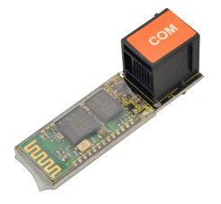

*Figura A36.1. Aspecto*

Hay dos tipos de módulos Bluetooth básicos, los modelos HC-05 y HC-06. La diferencia entre ellos es que el HC-05 es maestro-esclavo, lo que significa que además de recibir conexiones desde un ordenador, tablet o móvil Android, también es capaz de generar conexiones hacia otros dispositivos bluetooth. El HC-06 solo puede funcionar en modo esclavo. En [BlueTooth HC-05 y HC-06](https://fgcoca.github.io/BlueTooth-HC-05-y-HC-06/) hay disponible mas información sobre estos módulos. El módulo Bluetooth para la versión Easy Plug es del tipo HC-06.

Un módulo de comunicaciones Bluetooth tiene las 4 conexiones siguientes que son las que se implementan en el conector RJ11:

* Vcc: Alimentación 5V (+)
* Gnd: Alimentación 0V (-)
* Tx: Transmisión de datos
* Rx: Recepción de datos

Los pines Tx y Rx son precisamente los que utiliza la placa su programación por lo que cuando utilicemos este módulo debemos tener muy presente la siguiente advertencia:

> >  **¡ MUY IMPORTANTE ! Para cargar los programas es imprescindible *DESCONECTAR* el módulo Bluetooth.**
> >
> > **Si lo dejamos conectado impedirá la carga a través del puerto serie (Tx y Rx).**

En el apartado de bloques de programación, se encuentra en "Comunicaciones". La entrada Bluetooth dispone de los bloques que vemos Figura A36.2.

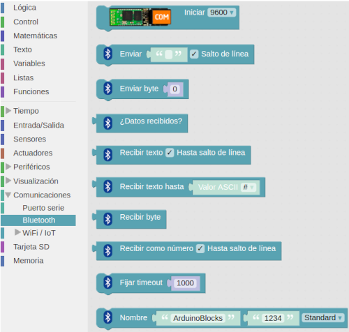

*Figura A36.2. Bloques*

Un programa como el que vemos en la Figura A36.3 nos permitirá trabajar con comandos AT y el módulo Bluetooth para poder configurarlo en sus distintas opciones.

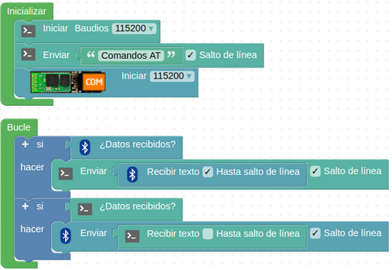

*Figura A36.3. Programa para comandos AT*

Para trabajar en el control por Bluetooth hacen faltan dos cosas: la placa Easy Plug con el módulo Bluetooth conectado y un programa y un móvil Android con una aplicación que permita el control. Para ello podemos crear nuestra propia aplicación para Android utilizando por ejemplo [APPInventor](https://appinventor.mit.edu/), que es una plataforma online en la que programar nuestras propias aplicaciones de modo muy similar a ArduinoBlocks. Pero no vamos a entrar en esto por ahora y lo que haremos será utilizar una aplicación ya existente como Arduino Bluetooth RC Car, que presenta el aspecto de la Figura A36.4 cuando se realiza su búsqueda para instalarla.

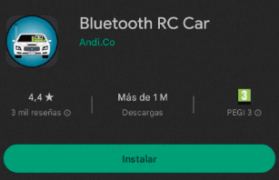

*Figura A36.4. Arduino Bluetooth RC Car lista para instalar*

Una vez instalada e iniciada la aplicación nos muestra la imagen que vemos en la Figura A36.5.

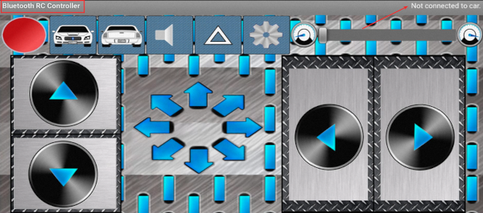

*Figura A36.5. Arduino Bluetooth RC Car iniciada*

Aunque es una interfaz muy completa para el control de un coche es sencilla de utilizar e intuitiva, razón por la que la vamos a usar para probar nuestro Bluetooth. Si hacemos clic sobre el botón del engranaje (menú) se nos abren las opciones que vemos en la Figura A36.6.

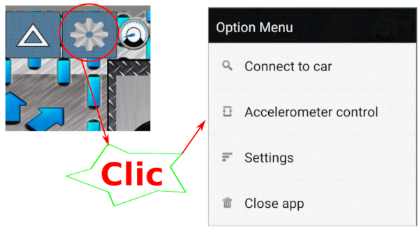

*Figura A36.6. Arduino Bluetooth RC Car menú*

Si clicamos sobre “Settings” nos aparece una ventana en la que se nos informa de los comandos/caracteres que enviamos desde la aplicación. En la Figura A36.7 vemos parte de la información que nos da “Setting”.

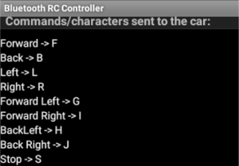

*Figura A36.7. Información de Setting*

Por ejemplo, cuando pulsamos el botón “Forward” (adelante) se envia el carácter “F” que en una letra del código ASCII por lo que en ArduinoBlocks debemos leer precisamente valores ASCII. El código ASCII pronunciado como “aski” (American Standard Code for Information Interchange o Código Estándar estadounidense para el Intercambio de Información) adoptado internacionalmente y que en sus primeros 128 símbolos básicamente define los números, letras mayúsculas y minúsculas y los principales signos de puntuación y que son comunes en casi todo el mundo. En la parte extendida es donde se definen los caracteres especiales de cada idioma, pero en esto ya no hay tanta unanimidad.

El bloque encargado de traducir los datos leídos en bytes es “Valor ASCII” y se encuentra al final del menú “Texto”.

Con el módulo Bluetooth conectado a alimentación realizamos las tareas de emparejamiento habituales entre el móvil y el módulo HC-06. Habitualmente la contraseña de emparejamiento del módulo es 1234.

## **Práctica A36.1**
Vamos a enviar comandos desde la APP para recibirlos via Bluetooth.

* Encender un LED utilizando el comando “Forward” y apagarlo con el comando “Back”. El programa lo tenemos en la Figura A36.8.

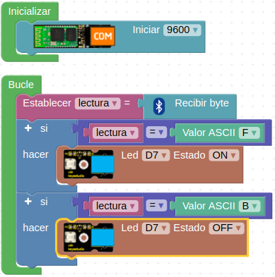

*Figura A36.8. Solución A36.1*

Desconectamos el módulo Bluetooth y cargamos el programa en la placa. Volvemos a conectar el módulo HC-06 y desde el menú de la APP  seleccionamos “Connect to car” para que se muestre la lista de dispositivos Bluetooth emparejados. Localizamos el módulo y lo seleccionamos, como en la Figura A36.9.

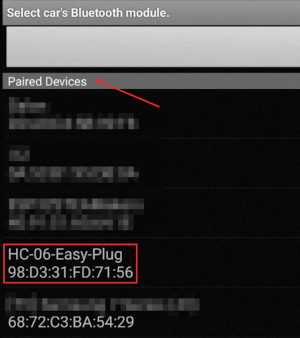

*Figura A36.9. Dispositivos emparejados en car*

Tras unos instantes el circulo rojo que parpadea en la esquina superior izquierda se queda fijo y en color verde, la APP nos informa de que está conectada al HC-06 y el LED del módulo que estaba parpadeando se queda fijo. En la Figura A36.10 vemos este estado.

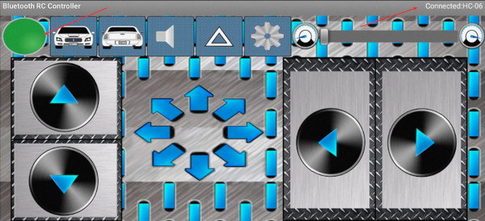

*Figura A36.10. App conectada y lista*

Ya podemos probar los botones y comprobar el funcionamiento del programa.

Para dejar de estar conectados sin abandonar la APP podemos seleccionar “Disconnect from car” (Figura A36.11) del menú. Lógicamente cuando cerramos la aplicación también se produce la desconexión.

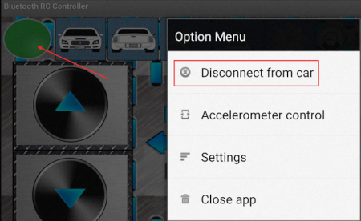

*Figura A36.11. Disconnect from car*

