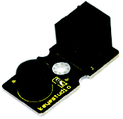

# A08-Zumbadores pasivo y activo
En la siguiente actividad trabajaremos con el zumbador, el cual es un actuador que se conecta a un puerto digital. Este zumbador es pasivo, ya que no puede ser accionado por él mismo sino por pulsos externos de diferente duración y frecuencia. Puede ser utilizado como un pequeño "altavoz" que puede generar melodías musicales.

El sonido que emite el zumbador depende de la frecuencia de emisión del sonido. La frecuencia se entiende como el número de repeticiones por unidad de tiempo. El sonido se transmite en forma de onda. Por tanto, la frecuencia de un sonido es el número de oscilaciones por segundo. En la Figura A08.1 vemos el aspecto del zumbador.

*Figura A08.1. Aspecto*

En el apartado de bloques de programación, se encuentra en "actuadores" (Figura A08.2). Hay diferentes opciones de programación, concretamente 4 bloques específicos, desde seleccionar una canción ya creada o decidir notas concretas.

*Figura A08.2. Bloques*

En la Figura A08.3 vemos la descripción del bloque "zumbador".

*Figura A08.3. Descripción*

## **Práctica A08.1**
En esta práctica crearemos la escala musical. Para ello puedes tener en cuenta la siguiente tabla.

| Nota | Frecuencia | Nota | Frecuencia | Nota | Frecuencia |
|:-:|:-:|:-:|:-:|:-:|:-:|
| Do | 261.6 | Fa | 349.2 | La | 440 |
| Do# | 277.2 | Fa# | 370 | La# | 466.2 |
| Re# | 293.7 | Sol | 392 | Si | 493,2 |
| Mi | 329.6 | Sol# | 415,3 | Do | 523,3 |

* Crea la escala de "Do". En la Figura A08.4 vemos la solución.

*Figura A08.4. Solución A08.1*

## **Práctica A08.2**
En esta práctica enviaremos al zumbador, una música ya diseñada por el programa.

* El zumbador reproduzca una canción y tras una espera de 5 segundos, reproducirá otra. En la Figura A08.5 vemos la solución.

*Figura A08.5. Solución A08.2*

¡Ahora puedes probar todas las canciones que quieras de la plataforma ArduinoBlocks!

Puedes buscar aún más canciones si haces clic con el botón derecho sobre el bloque y seleccionando "ayuda" (Figura A08.6).

*Figura A08.6. Buscar canciones*

Se muestran (Figura A08.7) enlaces a distintas webs donde obtenerlas.

*Figura A08.7. Enlaces a webs con canciones*

Existe otro tipo de zumbador que incluye un oscilador que genera una frecuencia audible fija y que se conoce como zumbador pasivo y en realidad es el que de forma correcta se puede denominar como zumbador. Este es mucho mas sencillo de usar ya que basta con conectarlo a un pin digital y cuando pongamos a nivel alto este pin el zumbador generará su zumbido característico. Con este tipo de zumbador no se pueden generar melodías. El aspecto cuando lo recibimos es el de la Figura A08.8.

*Figura A08.8. Aspecto zumbador activo nuevo*

Cuando está en este estado se distingue del zumbador pasivo o altavoz por la pegatina de protección, pero esta hay que quitarla para oir el zumbido y sin ella es dificil distinguir un tipo del otro, así que en este caso deberemos crear un programa con alguna melodía y si no se reproduce correctamente es que tenemos conectado el zumbador activo en lugar del pasivo. Lo mejor es marcar alguno de los dos cuando podemos distinguirlos.

## **Práctica A08.3**
En esta práctica crearemos con un pulsador y el zumbador activo un timbre de puerta.

* El zumbador activo debe estar emitiendo sonido mientras tengamos el pulsador accionado. En la Figura A08.9 vemos la solución.

*Figura A08.9. Solución A08.3*

