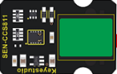
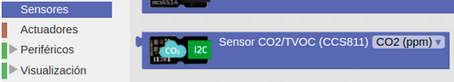
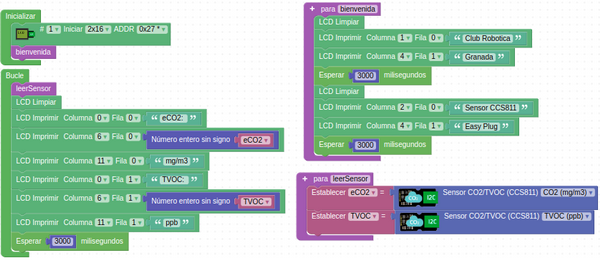
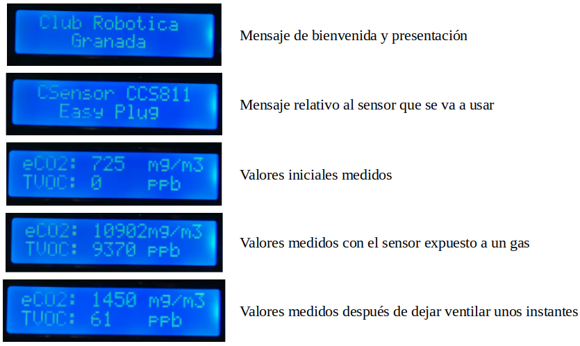

# A39-CCS811 Sensor de eCO2 (Dióxido de Carbono Equivalente) y TVOC
El sensor de gas CCS811B puede detectar una amplia gama de Compuestos Orgánicos Volátiles (VOCs del inglés Volatile Organic Compound) y está diseñado para monitorizar la calidad del aire.

El sensor devuelve una lectura de VOC Totales (TVOC) y una lectura de dióxido de carbono equivalente (eCO2).

Para aprender mas sobre los conceptos de VOC y eCO2 y como utilizar el sensor se aconseja visitar la web sobre [Semáforo óptico-acústico de CO2 y nivel de ruido](https://clubroboticagranada.github.io/semaforo-optico-acustico-CO2/) creada por el [Club Robótica Granada](https://clubroboticagranada.github.io/) en su entrada [Algunos conceptos sobre CO2 y VOC](https://clubroboticagranada.github.io/semaforo-optico-acustico-CO2/sobre-co2/co2/).

Su aspecto lo vemos en la Figura A39.1.

*Figura A39.1. Aspecto*

En el apartado de bloques de programación, se encuentra en "Sensores" (Figura A37.2).

*Figura A39.2. Bloques*

Se puede seleccionar entre ppm o mg/m³ como unidades para el CO2 y los VOC solamente se pueden mostrar en ppb.

## **Práctica A39.1**
Vamos a medir la calidad del aire de una habitación.

* Mostrar en una LCD un mensaje de bienvenida, otro relativo a lo que hace el programa y los datos medidos por el sensor CCS811. El programa lo tenemos en la Figura A39.3.

*Figura A39.3. Solución A39.1*

Un programa como este arroja unos resultados en la LCD como los que vemos en las imágenes de la Figura A39.4.

*Figura A39.4. Resultados A39.1*

