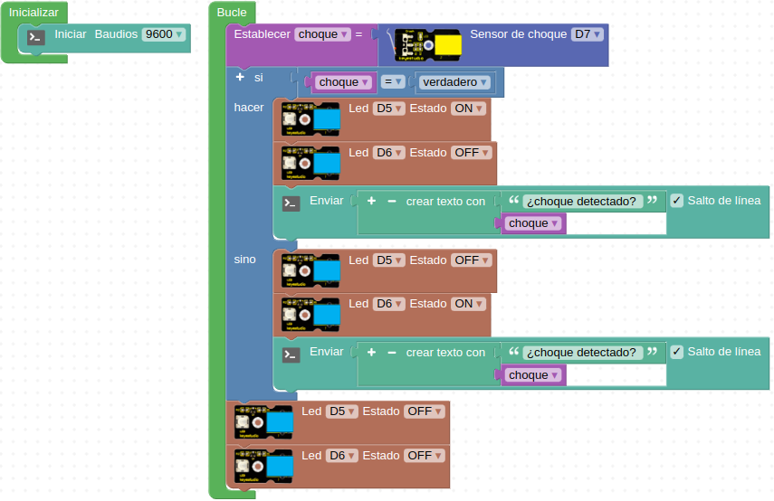

# A17-Sensor de colisión
El sensor de colisión o choque, es un interruptor de  acción rápida del tipo final de carrera que se activa con muy poca fuerza física. Es un módulo de encendido y apagado digital necesario para la electrónica elemental. Su aspecto lo vemos en la Figura A17.1.

*Figura A17.1. Aspecto*

En el apartado de bloques de programación, se encuentra en "Sensores" (Figura A17.2).

*Figura A17.2. Bloques*

## **Práctica A17.1**
En esta práctica vamos a encender y apagar unos LEDs cuando se acciona el interruptor de choque al tiempo que mostramos por la consola serie el valor de la variable “choque”.

* Leer el valor booleano entregado por el sensor de choque y si es “1” encender un LED verde mientras el rojo se mantiene apagado y si es “0” apagamos el verde y encendemos el rojo. En ambos casos  debemos mostrar el valor de la variable “choque” por consola. El programa lo tenemos en la Figura A17.3.

*Figura A17.3. Solución A17.1*

