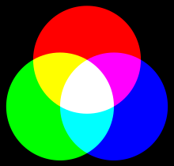
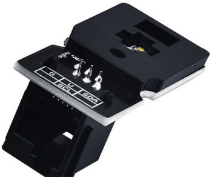
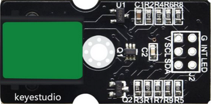
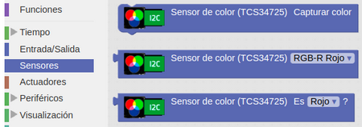
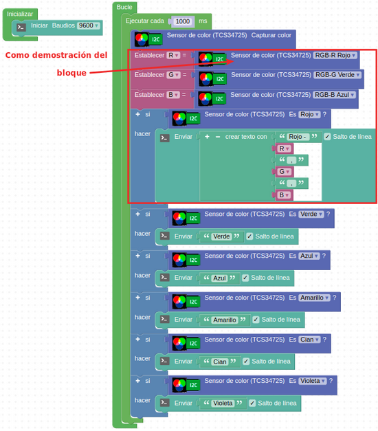

# A40-Sensor de color TCS34725
El modo [RGB](https://es.wikipedia.org/wiki/RGB) es un estándar de colores en la industria, que se obtiene cambiando los tres colores fundamentales: Rojo (Red), Verde (Green) y Azul (Blue) y superponiéndolos entre sí. Este estándar incluye casi todos los colores que la visión humana puede percibir y es uno de los sistemas de colores más utilizados. En la Figura A40.1 vemos como se comporta el modo aditivo de estos colores.

*Figura A40.1. Modo aditivo RGB*

El sensor de color TCS34725 es un sensor de reconocimiento de colores RGB que puede reconocer el color de la superficie de un objeto a través de la detección óptica.

Para evitar la interferencia del entorno y aumentar la precisión, lleva incorporada una placa de protección que es un filtro de luz infrarroja (Figura A40.2), de modo que su influencia en la medida se minimiza haciendo que el reconocimiento del color sea más preciso.

*Figura A40.2. Filtro IR*

El sensor también incorpora 4 LED de color amarillo rodeando al mismo, que garantizan que el sensor pueda usarse en condiciones de luz ambiental.

Trabaja a una frecuencia de reloj de 0 a 400 Khz y la distancia de detección va de 3 a 10 mm.

Su aspecto lo vemos en la Figura A40.3.

*Figura A40.3. Aspecto*

En el apartado de bloques de programación, se encuentra en "Sensores" (Figura A40.4).

*Figura A40.4. Bloques*

## **Práctica A40.1**
Vamos a reconocer diferentes colores.

* Mostrar en la consola el color detectado de los posibles del modo aditivo RGB de la Figura A40.1. El programa lo tenemos en la Figura A40.5. Los nombres de los colores son: Rojo, Verde, Azul, amarillo, Cian, Violeta y Blanco

*Figura A40.5. Solución A40.1*

