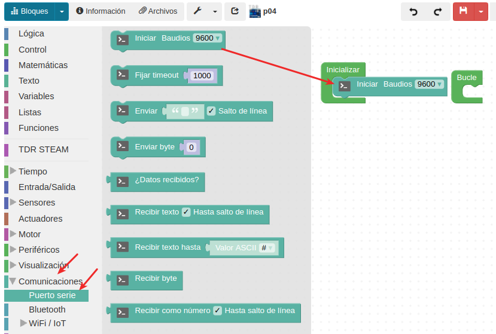
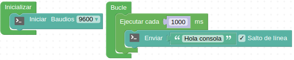
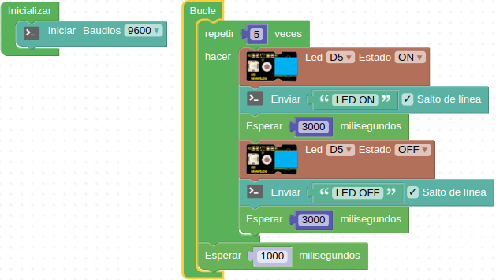
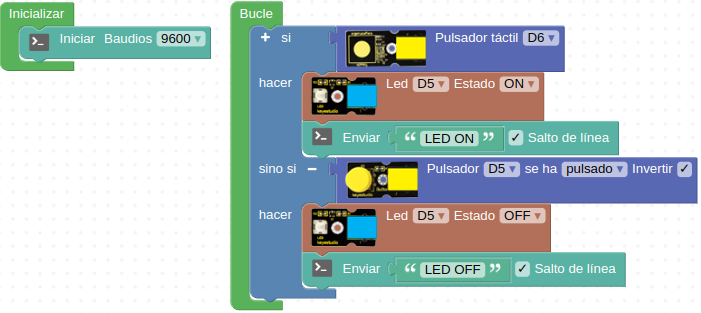

# A04-Consola serie
En esta práctica trabajaremos con la consola. Es una función del programa ArduinoBlocks que podemos programar para que se envíe información a la pantalla de nuestro ordenador.

Para poder "enviar" esta información necesitamos inicializar el "Puerto serie". Por tanto, dentro del bloque inicializar pondremos: "Iniciar Bauds", como vemos en la Figura A04.1. En ese caso, para enviar mensajes a la consola con el valor 9600 es suficiente.

*Figura A04.1. Inicializar puerto serie*

## **Práctica A04.1**
Comenzaremos esta primera actividad, enviando un mensaje a la consola, que diga "Hola consola". Es necesario inicializar el Puerto Serie, utilizando los Bauds.

• Cada segundo, en la consola debe aparecer "Hola consola" con salto de línea. El programa lo vemos en la Figura A04.2.

*Figura A04.2. Mensaje en consola*

## **Práctica A04.2**
Ahora que sabemos enviar un mensaje a la consola, combinaremos diferentes bloques de programación: control, actuadores, puerto serie y tiempo.

• Este programa, que vemos en la Figura A04.3, se repite durante 5 veces y entre repetición y repetición hay un segundo de espera: se enciende el LED y automáticamente se envía a la consola "LED ON", durante 3 segundos. Luego se apaga, y en la consola aparece "LED OFF" durante 3 segundos.

*Figura A04.3. Solución A04.2*

## **Práctica A04.3**
Ahora programaremos utilizando los bloques de lógica.

• Si hacemos clic en el pulsador táctil, el LED se enciende y en la consola aparece "LED ON". En cambio, si hacemos clic en el pulsador normal, el LED se apaga y en la consola se escribe: "LED OFF". El programa lo vemos en la Figura A04.4.

*Figura A04.4. Solución A04.3*

