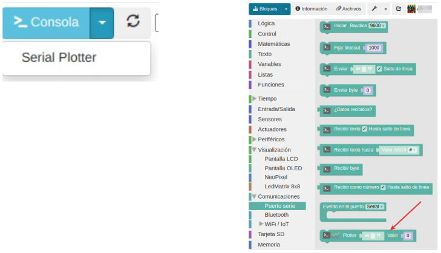

# A06 - Sensor de Temperatura y humedad DHT11
En esta sexta actividad aprenderemos a programar el sensor de temperatura y humedad o cómo se llama en ArduinoBlocks: DHT11. Este sensor se conecta a un puerto digital.
El sensor DHT11 realmente es un sensor de temperatura y humedad. Tiene una salida de señal digital, que funciona en un rango de temperaturas entre 0 y 50 °C, con un error de 2ºC y un rango de humedad entre 20 y 90%, con un error de un 5%. En la Figura A06.1 vemos su aspecto.

*Figura A06.1. Aspecto DHT11*

En el apartado de bloques de programación, se encuentra en "Sensores", como vemos en la Figura A06.2.

*Figura A06.2. Bloque DHT11*

Antes de empezar la práctica, establecemos dos variables nuevas (Figura A06.3): una para la temperatura y otra para la humedad.

*Figura A06.3. Declaración de variables*

## **Práctica A06.1**
En esta primera práctica enviaremos los valores a la consola, es decir, los grados centígrados y el porcentaje de humedad de la habitación donde estamos. Recuerda y utiliza el bloque de programación "crear texto con", el cual te permite añadir diferentes mensajes en una misma línea de texto.

* Envía a la consola los valores de temperatura y humedad cada 3 segundos. En la consola debe aparecer: Temperatura: X ºC seguido de Humedad: X %. En la Figura A06.4 vemos el programa.

*Figura A06.4. Solución A06.1*

## **Práctica A06.2**
Seguidamente, trabajaremos con la herramienta Plotter. Esta es parecida a la consola, de hecho se encuentra en el desplegable de consola. Esta herramienta crea en tiempo real una estadística de los valores obtenidos. Los bloques para programarlo, los encontraremos en el apartado 'Puerto serie'. En la Figura A06.5 vemos esto.

*Figura A06.5. Abrir Plotter y bloque programación*

* Envía cada 3 segundos al Serial Plotter los valores de temperatura y humedad. En la Figura A06.6 vemos el programa y el Plotter.

*Figura A06.6. Solución A06.2 y salida en Serial Plotter*

* Envía a la consola los valores de temperatura y humedad cada 3 segundos. En la consola debe aparecer: Temperatura: X ºC seguido de Humedad: X %. En la Figura A06.7 vemos el programa.

*Figura A06.7. Solución A06.1*

## **Práctica A06.3**
Otra forma de poder visualizar valores es haciendo uso de pantallas externas, es decir, pantallas conectadas a la placa Easy Plug. Tal y como podemos observar en el apartado de programación tenemos tres pantallas:

* Pantalla LCD: Es una pantalla LCD de 16 caracteres por 2 líneas con fondo azul y luz blanca. Se conecta al puerto I2C. Tiene el aspecto de la Figura A06.8.
  

*Figura A06.8. LCD1602*

* Pantalla OLED: El nombre es una abreviatura de “Organic Light-Emitting Diode” que se traduce como "Diodo Emisor de luz orgánico". Una pantalla OLED es una matriz de LEDS orgánicos que se iluminan cuando emiten energía y que tiene el aspecto de la Figura A06.9.

*Figura A06.9. OLED*

* LedMatrix 8x8: Es una matriz de de 8x8 LEDS con el aspecto de la Figura A06.10.

*Figura A06.10. LedMatrix 8x8*

En esta práctica A06.3 enviaremos los mismos datos que hemos estado enviando a Consola y al Serial Plotter a nuestra pantalla LCD. Así pues, debes conectar la placa al puerto I2C.

Los bloques de programación de la pantalla LCD son los de la Figura A06.11.

*Figura A06.11. Bloques*

Hay que seleccionar el primero, y colocarlo en el bloque "Inicializar". También aparecen los bloques que nos servirán para enviar la información a la placa. Es importante establecer a qué fila queremos que se envíe la información. El número 0, ya cuenta como una opción.

* Envía a la pantalla LCD los valores de temperatura y humedad cada 3 segundos. El programa los vemos en la Figura A06.12.

*Figura A06.12. Solución A06.3*

