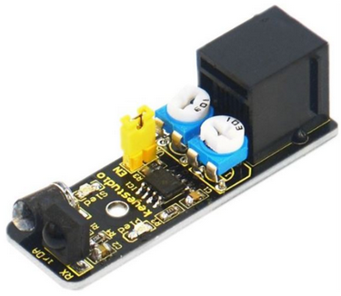
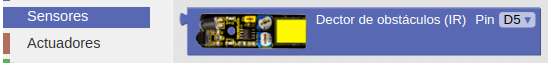
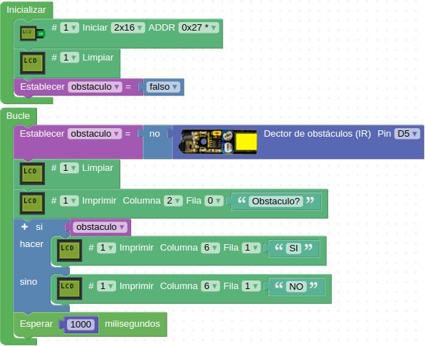

# A22-Sensor infrarrojo para evitar obstáculos
Se trata de un sensor digital que entrega una lectura de nivel TTL. El sensor está equipado con función de ajuste de distancia con una gran adaptabilidad a la luz ambiental y es de alta precisión. Tiene un diodo de transmisión y un fototransistor de recepción de infrarrojos. Cuando el rayo infrarrojo lanzado por el LED transmisor encuentra un obstáculo el rayo se refleja y el fototransistor lo recibe, siendo esto procesado por un circuito comparador que detectará el obstáculo y el LED indicador de la placa se iluminará. Cuando se usa para detectar líneas básicamente el rayo emitido se refleja si el color es blanco y no hay reflexión si el color es negro pudiendo así detectar estos colores de línea. Se puede ajustar la distancia de detección con las dos resistencias variables de que está equipado en un rango efectivo entre 2 y 40 cm.

Básicamente se puede utilizar para evitar obstáculos y para robots seguidores de línea bien en color blanco o bien en color negro. Su aspecto lo vemos en la Figura A22.1.

*Figura A22.1. Aspecto*

En el apartado de bloques de programación, se encuentra en "Sensores" (Figura A22.2).

*Figura A22.2. Bloques*

## **Práctica A22.1**
Vamos a realizar un detector muy básico de obstáculos.

* Mostrar en una LCD el texto ¿Obstaculo? Y el mensaje SI o NO en función de que exista o no dicho obstáculo dentro del rango de detección del sensor. El programa lo tenemos en la Figura A22.3.

*Figura A22.3. Solución A22.1*

