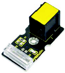
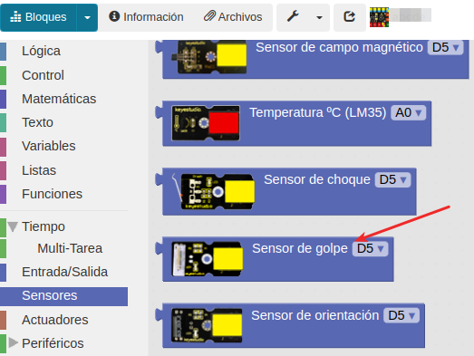
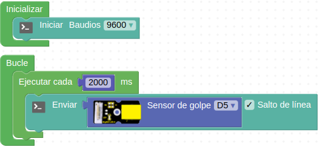
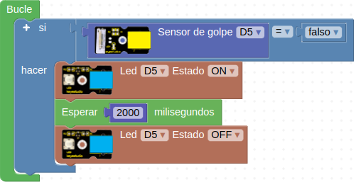
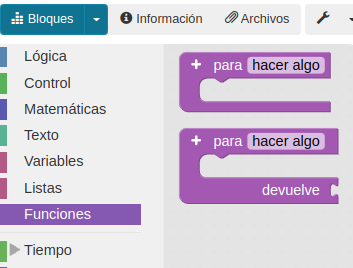
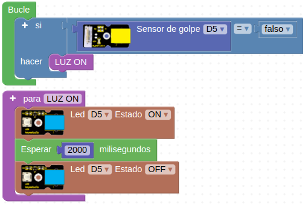

# A11-Sensor de golpe
A lo largo de esta práctica aprenderemos a programar el sensor de golpe, que es un sensor detector de golpes, como su propio nombre indica. Por tanto, cuando se golpea puede enviar una señal al instante. Se puede utilizar para sustituir el pulsador para encender un LED cuando golpeamos el sensor o también que cuando lo golpeamos se emita un sonido. En la Figura A11.1 vemos su aspecto.

*Figura A11.1. Aspecto*

En el apartado de bloques de programación, se encuentra en "Sensores" (Figura A11.2).

*Figura A11.2. Bloques*

## **Práctica A11.1**
Al ser un sensor nuevo, antes de nada lo que haremos será "leerlo". Es decir, enviaremos sus valores a la consola. En la Figura A11.3 vemos el programa.

*Figura A11.3. Solución A11.1*

Este sensor da cómo salida 1 y de forma instantánea, cuando se golpea, un 0. Un programa como el anterior va a originar que en la consola siempre tengamos el mismo valor: 1.  El "problema" es que es una señal tan rápida y débil que no podemos visualizar su valor en la consola.

## **Práctica A11.2**
En esta práctica aprenderemos a encender un LED utilizando el sensor de golpe. Conectamos tanto el LED como el sensor de golpe a puertos digitales.

* Cuando damos un golpe, que el LED se encienda durante 2 segundos y que después se apague.

Sabemos que el sensor da 1 cuando no hay "golpe" y 0 cuando si hay "golpe". Por tanto, los valores de este sensor se mueven entre dos posibles: sí/no, verdad/falso, 1/0... Así pues, en este programa debemos preguntar si el valor que devuelve el sensor de golpe es falso, es decir, que está a 0 y si es así que se encienda el LED. El programa lo vemos en la Figura A11.4.

*Figura A11.4. Solución A11.2*

Siguiendo con esta práctica, realizaremos una pequeña modificación e introduciremos el concepto de "función". ArduinoBlocks tiene un apartado llamado "funciones" que vemos en la Figura A11.5.

*Figura A11.5. Menú funciones*

Para entender lo que es una función, podemos describirlo como un conjunto de instrucciones que las agrupamos bajo un nombre. Cuando creamos una función, automáticamente se genera un bloque de esa función y se puede insertar en cualquier momento del programa para invocarla. Es una forma de agilizar y hacer mas legible la programación y para que en programaciones más "grandes" nos quede todo un poco más ordenado.

En nuestro caso agruparemos la programación "LED ON, esperar 2000 milisegundos, LED OFF" en una función llamada LUZ ON, tal y como observamos en la Figura A11.6.

*Figura A11.6. Función LED ON*

