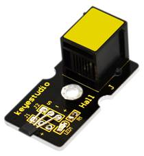
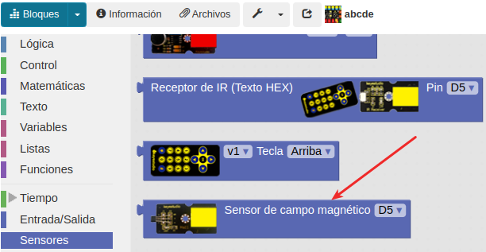
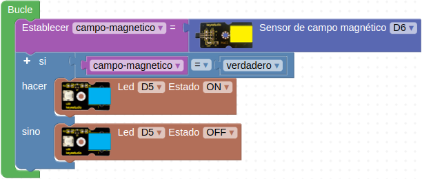

# A16-Sensor de campo magnético de efecto Hall
El sensor de campo magnético se basa en el efecto Hall y puede detectar sin contacto si existe un objeto que genera un magnético cerca de él. El resultado lo muestra a través de su salida digital.
El rango de detección y la fuerza del campo magnético son proporcionales. Se conoce como efecto Hall a la aparición de un campo eléctrico por separación de cargas en el interior de un conductor por el que circula una corriente en presencia de un campo magnético. Su aspecto lo vemos en la Figura A16.1.

*Figura A16.1. Aspecto*

En el apartado de bloques de programación, se encuentra en "Sensores" (Figura A16.2).

*Figura A16.2. Bloques*

## **Práctica A16.1**
En esta práctica vamos a encender un LED cuando se detecta un campo magnético.

* Leer el valor booleano entregado por el sensor Hall y si es “1” encender un LED rojo y si es “0” mantenerlo apagado. El programa lo tenemos en la Figura A16.3.

*Figura A16.3. Solución A16.1*

