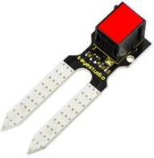
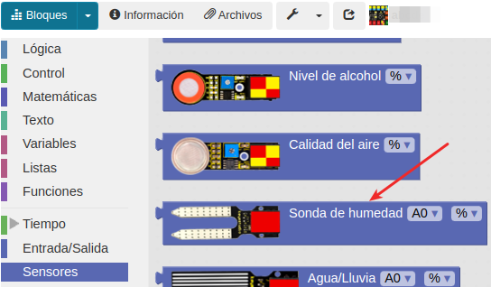
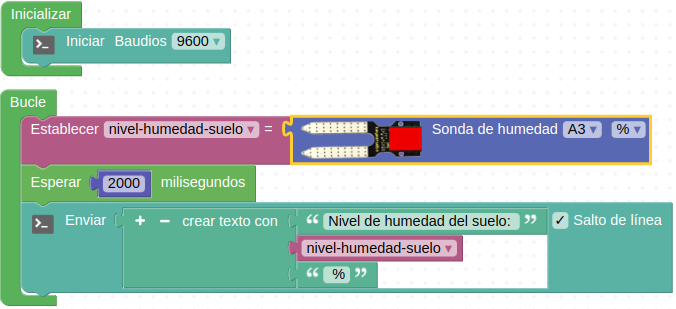

# A15-Sensor del nivel de humedad del suelo
El sensor de humedad del suelo utiliza dos sondas para pasar corriente a través del suelo y leer la resistencia que sirve para obtener el nivel de humedad. Si el suelo está muy húmedo habrá mas conducción de electricidad debido a la menor resistencia, mientras que un suelo seco conduce mal la electricidad porque presenta una resistencia mayor. El dispositivo se puede usar para hacer un dispositivo de riego automático de plantas o jardines. Su aspecto lo vemos en la Figura A15.1.

*Figura A15.1. Aspecto*

En el apartado de bloques de programación, se encuentra en "Sensores" (Figura A15.2).

*Figura A15.2. Bloques*

## **Práctica A15.1**
En esta práctica vamos a leer los valores que no entrega el sensor para distintos niveles de humedad.

* Leer y mostrar por consola el valor de humedad entregado por el sensor totalmente seco, en una tierra con poca humedad y en una tierra con mucha humedad. El programa lo tenemos en la Figura A15.3. En lugar de tierra podemos utilizar algún elemento que sea capaz de retener la humedad, como por ejemplo algodón.

*Figura A15.3. Solución A15.1*

