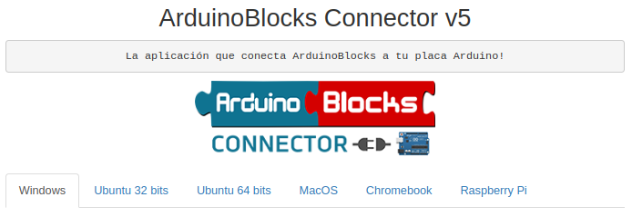

# 1. Mis notas sobre programación de la placa Easy Plug con ArduinoBlocks
Estas notas se dedican a la programación de la placa de control Ks0240 keyestudio EASY plug V2.0 con ArduinoBlocks a partir de diferentes actividades y/o retos incluyendo información básica de los componentes y de programación de manera progresiva.

## **1.1. Elementos y componentes Easy Plug**
Easy Plug es una placa donde podemos conectar diferentes sensores y actuadores de forma muy sencilla. Además, se pueden crear diferentes programas, proyectos y experimentos muy interesantes para niñas y niños de los últimos cursos de Educación Primaria así como, durante la etapa de educación secundaria.

Sus características técnicas principales son:

* Es compatible con Arduino Uno
* Cinco puertos digitales (de entrada y salida)
* Cuatro puertos de entrada analógica
* Un puerto SPI
* Un puerto I2C.
* Sus conectores son pines RJ-11 de cuatro hilos, lo que les hace mucho más fáciles para conectarlos y evitar malas conexiones.

En la Figura 1.1 vemos una imagen de la placa con rótulos descriptivos de la misma.

*Figura 1.1. Descripción de la placa Easy Plug*

## **ArduinoBlocks: programa, acceso e interfaz**
Arduino es una plataforma de prototipos de código abierto, basada en hardware y software flexibles y fáciles de utilizar. Su finalidad es que todo el mundo pueda generar proyectos y entornos interactivos mediante placas y sensores compatibles con Arduino.

Arduino se programa con lenguaje C++ y se necesita el IDE (Integrated Development Environment), que permite escribir el código. Programar con C++ puede resultar complejo y no es accesible para todos, por eso, [Juanjo López](https://twitter.com/JuanjoLopezIbi) creó [ArduinoBlocks](http://www.arduinoblocks.com/web/), que es un lenguaje de programación por bloques que se ejecuta en la nube. Los diferentes bloques de programación sirven para leer y escribir las entradas y salidas de la placa.

Podemos registrarnos en la web, para guardar los proyectos, podemos añadir información a nuestros proyectos y ver proyectos de otros usuarios que hayan decidido compartirlos de forma pública. En la Figura 1.2 vemos la portada de la página web.

*Figura 1.2. Página principal web ArduinoBlocks*

## **¿Cómo se trabaja con ArduinoBlocks?**
Para empezar a trabajar con ArduinoBlocks, es necesario registrarse utilizando un correo válido, pues habrá que validar la cuenta con ese correo, y crear un nuevo usuario. Debemos acceder al botón "Iniciar sesión" para después, seleccionar la opción de nuevo usuario, tal y como se indica en la Figura 1.3.

*Figura 1.3. Inicio de sesión en ArduinoBlocks*

A continuación, se debe seleccionar "Empezar un proyecto nuevo" (Figura 1.4). 

*Figura 1.4. Iniciar un nuevo proyecto*

Nos aparecen tres opciones: proyecto personal, profesor o alumno, tal y como vemos en la Figura 1.5.

*Figura 1.5. Opciones de proyecto*

Si escogemos el proyecto personal sólo podremos acceder nosotros, pero después lo podemos compartir si decidimos hacerlo público. En cambio, si seleccionamos el proyecto profesor, no se comienza un proyecto sino que se crea un código para que los alumnos puedan inscribirse en el proyecto. De esta forma, el profesor puede supervisar las programaciones de sus estudiantes. Por último, la opción de alumno es para unirnos al proyecto planteado por el profesor. Para aprender mas sobre [Usuarios Gestionados](https://drive.google.com/file/d/1uAhhYuQAzDbvmxJTRvDOK_rG4yPoQrxr/view?usp=drive_web) basta con acceder a la presentación del enlace anterior que se adjunta como anexo a este documento.

## **Interfaz de programación de ArduinoBlocks**
Una vez hemos escogido la opción de proyecto personal, nos pregunta qué placa estamos utilizando y qué nombre queremos dar a nuestro proyecto. A su vez, podemos añadir información, como: descripción del proyecto, componentes que necesitamos y otras especificaciones en el apartado de comentarios. En nuestro caso escogeremos: **Keyestudio EasyPlug**. Toda esta información es la que se ve en la Figura 1.6.

*Figura 1.6. Placa, nombre del proyecto,...*

Una vez ponemos nombre, y aunque es opcional se recomienda cumplimentar los distintos apartados, y hacemos clic en el botón “Nuevo proyecto” entramos en el entorno de programación para el nuevo proyecto. Nos encontramos con la pantalla de la Figura 1.7 que está autodescrita.

*Figura 1.7. Entorno de programación*

Ya es posible guardar nuestros bloques favoritos de ArduinoBlocks en la mochila y llevarlos siempre con nosotros o usarla para compartir bloques entre nuestros proyectos. En este [enlace](https://twitter.com/ArduinoBlocks/status/1506352610059689988?s=20&t=GzAqgtY4gySw5FPZgOOzjA) tienes un video que lo explica de forma gráfica.

## **ArduinoBlocks Connector**
ArduinobBloks genera el código de Arduino a partir de los bloques. El programa copia y sube nuestra programación a la placa gracias a la aplicación ArduinoBlocks Connector. Si no ejecutamos ArduinoBlocks Connector, podremos programar y acceder a la plataforma ArduionBlocks, pero no podremos subir nuestro programa a la placa. Así pues, es necesario instalarlo en nuestro ordenador, y ejecutarlo cuando hagamos uso de la plataforma.

Actualmente, está disponible la versión 5 para estos sistemas operativos: Windows, Ubuntu, MacOS, Chromebook y Raspberry Pi, como vemos en la Figura 1.8.

*Figura 1.8. Disponibilidad de ArduinoBlocks Connector*

## **Sensores**
Los sensores permiten recabar información para que sea procesada por la placa y se accionen ciertas programaciones según nuestra finalidad. Hay varios tipos de sensores. Por ejemplo, si vamos al apartado de "Sensores" del menú de herramientas de ArduinoBlocks, para la placa EasyPlug, existen varios. Algunos de ellos los vemos en la Figura 1.9.

*Figura 1.9. Algunos tipos de sensores*

En la Figura 1.10 vemos el aspecto real de algunos sensores que programaremos.

*Figura 1.10. Sensores*

## **Actuadores**
Los actuadores se accionan cuando la placa procesa la programación, que puede estar influida por la recogida de datos de algún sensor.

Hay varios tipos de actuadores. Por ejemplo, si vamos al apartado de "actuadores" del menú de herramientas de ArduinoBlocks, para la placa EasyPlug, existen varios. Algunos de ellos los vemos en la Figura 1.11.

*Figura 1.11. Algunos tipos de actuadores*

En la Figura 1.12 vemos el aspecto real de algunos actuadores que programaremos.

*Figura 1.12. Actuadores*

