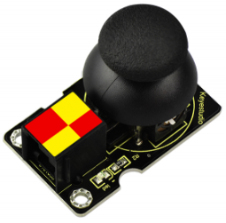
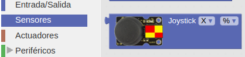
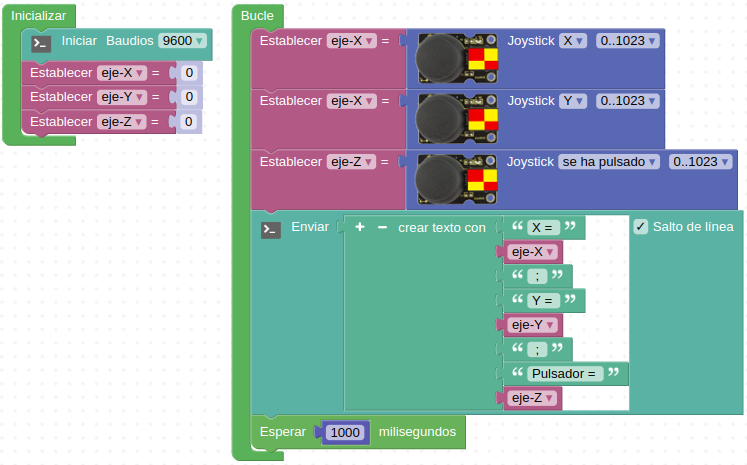
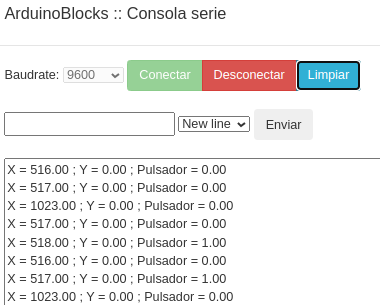

# A27-Módulo joystick
El módulo se componen de dos potenciómetros, uno para el movimiento del eje X y otro para el movimiento del eje Y asociados a entradas analógicas y además incorpora un pulsador asociado a un pin digital. En la placa EASY PLUG existe un terminal de conexionado marcado en rojo y amarillo que son los pines A6, A7 y D2. Este mismo tipo de conexión la lleva el módulo joystick con la siguiente relación de conexionado:
* El eje X se conecta a A6
* El eje Y se conecta a A7
* El pulsador o eje Z se conecta a D2

Su aspecto lo vemos en la Figura A27.1.

*Figura A27.1. Aspecto*

En el apartado de bloques de programación, se encuentra en "Sensores" (Figura A27.2).

*Figura A27.2. Bloques*

## **Práctica A27.1**
Vamos a mostrar por consola los valores leídos del sensor.

* Mostrar en la consola el valor de cada uno de los ejes en función de la posición del mando del joystick y también indicar si se ha accionado el pulsador. El programa lo tenemos en la Figura A27.3.

*Figura A27.3. Solución A27.1*

El aspecto de la consola con los datos recibidos lo vemos en la Figura A27.4.

*Figura A27.4. Consola de la actividad A27.1*

