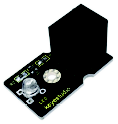
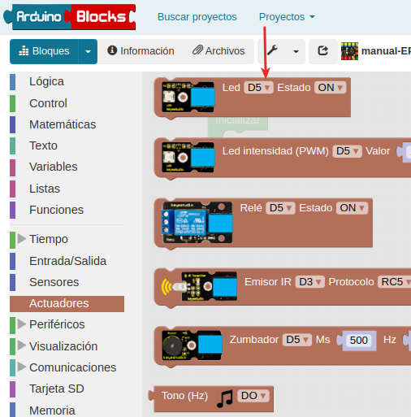
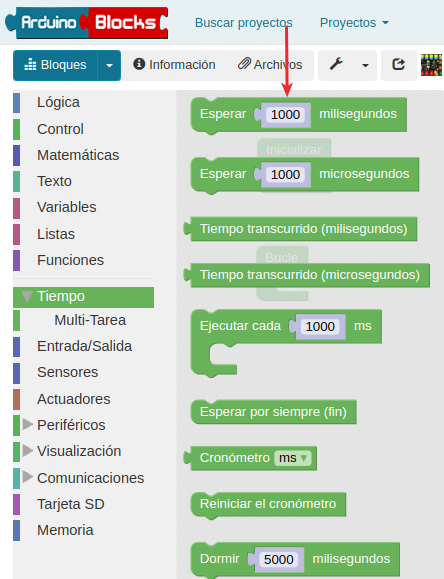
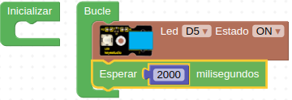
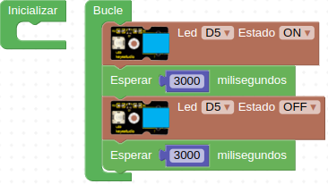
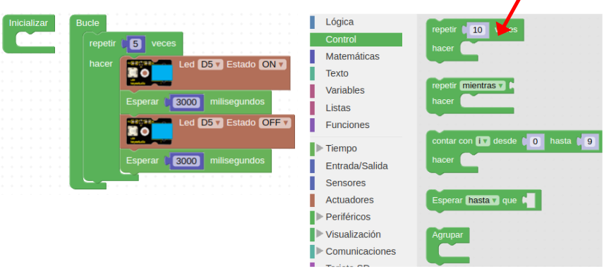
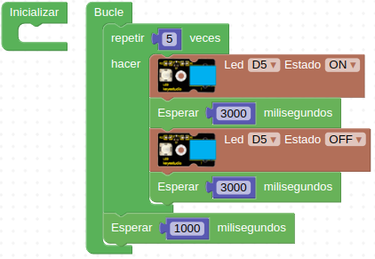

# A01 - LED
En esta primera actividad con EasyPlug aprenderemos a encender un LED y a programarlo para que se apague y encienda durante un tiempo determinado. En la Figura A01.1 vemos el aspecto del componente.

*Figura A01.1. LED*

El LED es un actuador y por tanto, lo encontraremos en el apartado de actuadores, tal y como observamos en la Figura A01.2.

*Figura A01.2. Bloque LED*

Si necesitamos programar un tiempo de retardo, deberemos ir al apartado de "Tiempo", tal y como observamos en la Figura A01.3.

*Figura A01.3. Bloques tiempo*

## **Práctica A01.1**

• Encendre un LED. En la Figura A01.4 vemos como iniciamos el programa arrastrando los bloques a la zona de programa desde los menú.

*Figura A01.4. Programa inicial LED*

En el ejemplo la espera en realidad no sirve para mucho y el LED permanecerá a nuestros ojos siempre encendido.

## **Práctica A01.2**

• Encendre un LED, esperar 3 segundos, apagar el LED y esperar otros 3 segundos. En la Figura A01.5 vemos el programa resuelto.

*Figura A01.5. Programa parpadeo LED*

Deduce y comprueba el efecto de no poner el tiempo de retardo tras apagar el LED.

## **Práctica A01.3**

• Repetir la acción de la práctica A01.2 cinco veces. En la Figura A01.6 vemos el programa resuelto. En la parte derecha de la misma Figura vemos donde se localiza el bloque repetir.

*Figura A01.6. Repetir parpadeo LED*

## **Práctica A01.4**

• Repetir la acción de la práctica A01.3 esperando un segundo entre repeticiones. En la Figura A01.7 vemos el programa resuelto.

*Figura A01.7. Repetir parpadeo LED con espera*

## **Práctica A01.5**
Para esta práctica conectamos dos LEDS a la placa, LED 1 en D5 y LED 2 en D7.

• Se enciende LED 1 (D5) esperamos 2 segundos, se apaga el LED 1 y se enciende el LED 2 (D7) y esperamos 2 segundos y se apaga. Esta acción se repite 3 veces. En la Figura A01.8 tenemos la solución.

*Figura A01.8. Encender y apagar dos LEDs*

