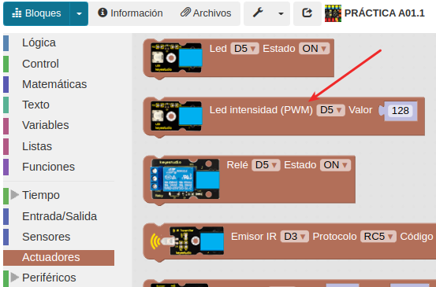
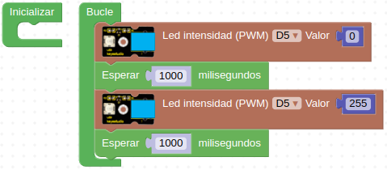
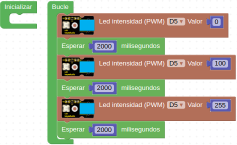
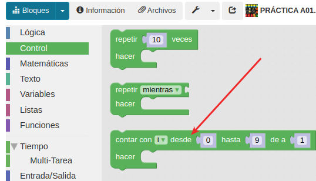
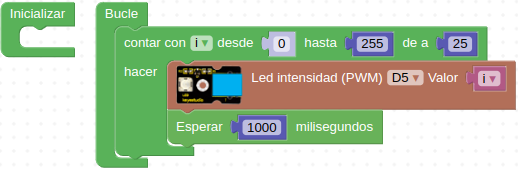

# A02 - Control por PWM de la luminosidad de un LED
Siguiendo con el uso de los LEDs, controlaremos la intensidad de un LED utilizando el PWM, que es el acrónimo de Pulse Width Modulation y significa Modulación por Anchura de Pulsos.

Las patillas de salida de Arduino sólo tienen dos estados posibles: ON y OFF, es decir, una corresponde a una salida de 5V (ON) y otra de 0V (OFF). Si sólo hacemos uso de estas dos condiciones, sólo podemos realizar actividades como encender y apagar un LED. Gracias al PWM podemos programar un rango de valores de 0 a 255 que haga variar estas tensiones entre los 0V y los 5V. De esta forma podemos controlar la intensidad con la que luce un LED.

Encontramos el bloque de programación en el apartado de actuadores, tal y como observamos en la Figura A02.1.

*Figura A02.1. Bloque PWM LED*

## **Práctica A02.1**

• Programamos el LED a un valor de 255 para que se encienda al máximo de iluminación y después de un segundo, que se apague. Es decir, ponemos el valor a 0. En la Figura A02.2 tenemos la solución.

*Figura A02.2. Encender y apagar LED con bloque PWM*

## **Práctica A02.2**
Hacer que la intensidad del LEDde la práctica A02.1 cambie.

• Cada 2000 milisegundos la intensidad del LED debe cambiar, aumentando de 0 a 100 y 255. En la Figura A02.3 tenemos la solución.

*Figura A02.3. Cambiar intensidad LED con bloque PWM*

## **Práctica A02.3**
Para poder programar de una forma más práctica y efectiva el PWM, podemos hacer uso del bloque “Contar” situado en el apartado de "Control", como vemos en la Figura A02.4. Éste permite contar desde un determinado número hasta otro. A su vez, podemos decidir con qué frecuencia, es decir, cada dos números o cada diez.

*Figura A02.4. Bloque contar*

En este bloque existe un nuevo concepto que es muy utilizado en programación: las variables. En esta actividad las utilizaremos de forma muy rápida, pero más adelante serán herramientas necesarias para que nuestra programación tenga sentido. Justamente, en nuestro bloque la variable se llama "i".

• La intensidad del LED debe aumentar de 25 en 25, desde 0 a 255. En la Figura A02.5 vemos el programa.

*Figura A02.5. Cambiar intensidad LED con bloque PWM*

El bloque con el nombre de la variable lo vamos a encontrar en “Variables”.
