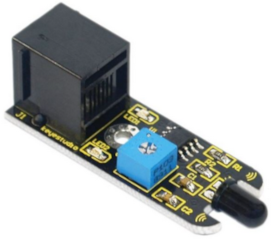
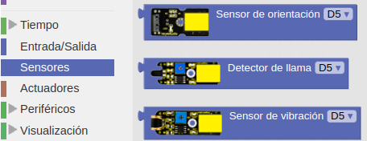
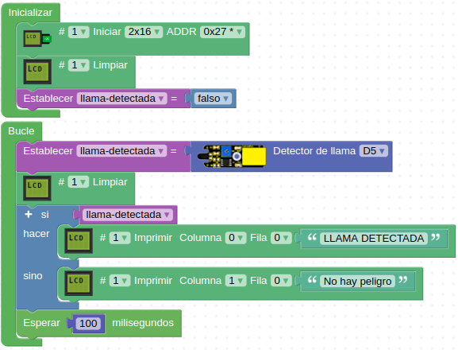

# A20-Sensor de llama
Es un sensor digital que puede detectar fuego o cualquier otra llama cuya luz tenga una longitud de onda entre 760 nm y 1100 nm, es decir, desde el rojo visible de las llamas hasta el infrarrojo de las mismas. Un robot contra incendios usará un detector de este tipo como sonda detectora de la fuente del fuego.

Sus principales características son:

* Alimentación: 3.3V a 5V
* Ancho de banda espectral: 760nm a 1100nm
* Temperatura de trabajo: -25 °C a 85 °C

El potenciómetro sirve para ajustar la sensibilidad del sensor. Su aspecto lo vemos en la Figura A20.1.

*Figura A20.1. Aspecto*

En el apartado de bloques de programación, se encuentra en "Sensores" (Figura A20.2).

*Figura A20.2. Bloques*

## **Práctica A20.1**
Vamos a detectar la llama de un encendedor a gas.

* Mostrar en una LCD el mensaje “LLAMA DETECTADA” cuando esto ocurra y mientras tanto el mensaje “No hay peligro”. El programa lo tenemos en la Figura A20.3.

*Figura A20.3. Solución A20.1*

## **Práctica A20.2**
Se propone como actividad mejorar la anterior haciendo que cuando se detecta llama también se emite un sonido tipo sirena y que un LED parpadee. Además añadiremos dos diodos LED que se encenderán y apagarán de forma alternativa mientras suena la alarma.
