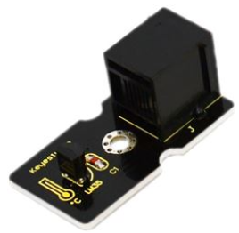
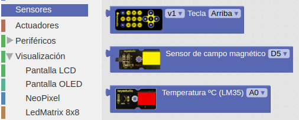
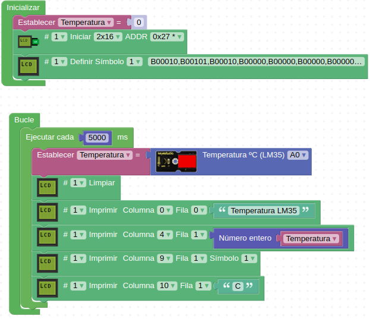

# A19-Sensor de temperatura LM35
El LM35D es un sensor analógico de temperatura que tiene un rango de medida que va desde los -55ºC hasta los 150°C y una sensibilidad de 10 mV/ºC. Es decir, su salida es lineal y cada grado Celsius equivale a 10 mV, por lo tanto: 

- 150°C = 1500 mV
- -55°C = -550 mV

Sus principales características son:

- Está calibrado para dar la medición en Celsius
- Factor de escala lineal de ± 10 mV/°C
- Precisión de 0.5 °C (a 25°C)
- Adecuado para aplicaciones que trabajan en remoto 
 
Su aspecto lo vemos en la Figura A19.1.

*Figura A19.1. Aspecto*

En el apartado de bloques de programación, se encuentra en "Sensores" (Figura A19.2).

*Figura A19.2. Bloques*

## **Práctica A19.1**
Vamos a medir la temperatura ambiente de una habitación.

* Mostrar en una LCD la temperatura medida por un LM35. El programa lo tenemos en la Figura A19.3.

*Figura A19.3. Solución A19.1*

