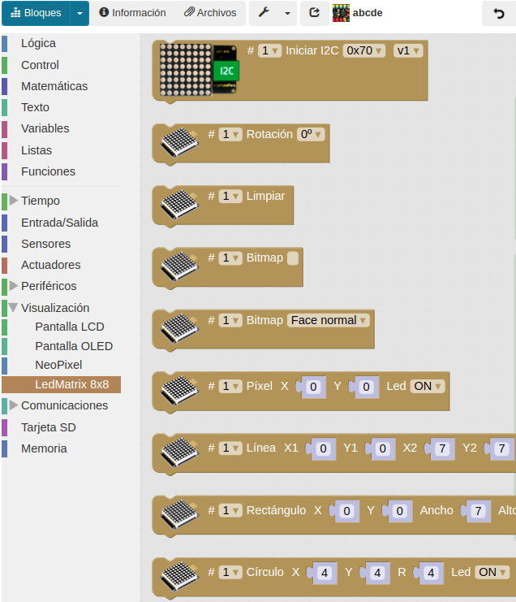

# A07-Matriz de 8x8 LEDs
En esta práctica el objetivo es conocer la LEDMatrix 8x8 o también llamada matriz de LEDs.

La matriz de LEDs es una pantalla pequeña que tiene 64 LEDs con el aspecto de la Figura A07.1 y se conecta al puerto de comunicación I2C.

En esta pantalla podemos programar diferentes símbolos o elementos, como: caras, iconos, letras... Hay opciones prediseñadas desde ArduinoBlocks y también, existe la opción de crearlos personalizados.

*Figura A07.1. Aspecto matriz 8x8*

En el apartado de bloques de programación, se encuentra en "LedMatrix 8x8" (Figura A07.2). Existen diferentes opciones de programación, según nuestro objetivo.

*Figura A07.2. Bloques*

La primera tarea que debemos realizar cuando queremos hacer uso de la pantalla, es inicializarla. En la Figura A07.3 el primer bloque vemos que pone: inicializar I2C.

*Figura A07.3. Inicializar*

Hay una pestaña que nos deja escoger distintos números. Esto significa que podemos utilizar ocho diferentes haciendo uso de un Hub I2C como el de la Figura A07.4. Un Hub sería como un "ladrón", que nos permite conectar varios dispositivos a la vez. Éste se conecta al puerto I2C.

*Figura A07.4. Hub I2C*

## **Práctica A07.1**
En esta práctica introduciremos el uso de la LedMatrix. Lo que haremos es enviar un programa sencillo:

* La pantalla LedMatrix muestra una flecha hacia arriba, y después de dos segundos, muestra una flecha hacia abajo. Vemos el programa en la Figura A07.5.

*Figura A07.5. Solución A07.1*

## **Práctica A07.2**
En esta práctica introduciremos otra forma de diseñar símbolos en la pantalla y también haremos uso de un pulsador.

* Cuando se pulse el pulsador, en la pantalla debe aparecer un símbolo personalizado durante dos segundos y después otro distinto. Vemos el programa en la Figura A07.6.

*Figura A07.6. Solución A07.2*

## **Práctica A07.3**
En esta tercera práctica recrearemos el famoso y conocido juego "Piedra, papel, tijera". Esta vez, aprenderemos otra forma de crear nuestros símbolos personalizados. También utilizaremos el pulsador para activar el juego y aprenderemos a crear una variable que elija aleatoriamente uno de los tres símbolos del juego.

* Cuando se pulse el pulsador, la pantalla muestra, de forma aleatoria, uno de los tres símbolos: piedra, papel o tijeras.

Lo primero que vamos a hacer es crear los tres símbolos: utilizando el "Bitmap". Para seleccionar los LEDs que queremos en estado ON, debemos dar los siguientes pasos:

1. Nos dirigimos a herramientas y escogemos según la Figura A07.7.  También podemos hacer clic en el botón derecho del ratón sobre el bloque de programación, escoger la opción "ayuda". De cualquiera de las formas se nos abre otra pestaña en la que podemos ver un simulador de la pantalla.

*Figura A07.7. Acceso LedMatrix - Bipmap Editor*

2. Seleccionamos cada LED que queremos encender, así se nos devolverá de color rojo.
3. Por último, seleccionamos "Copy data" y dentro del cuadradito que está al lado de "bitmap", hacemos Ctrl+V y se nos engancha en código binario los LEDs que hemos seleccionado.
4. Creamos, las imágenes que vemos en la Figura A07.8.

*Figura A07.8. Creación de las imágenes*

Para realizar esta práctica, vamos a necesitar crear una variable que llamaremos "Juego". Esta variable le asignamos tres números aleatorios, del 1 al 3. De este modo, asignaremos a cada número un símbolo. Es decir, que 1 es piedra, 2 es papel y 3 es tijeras. El bloque de programación: "entero aleatorio de x a x" lo encontramos en "Matemáticas" (Figura A07.9). Éste nos permite escoger aleatoriamente el rango de números que nosotros establecemos.

*Figura A07.9. Bloque entero aleatorio de x a x*

Así pues, crearemos la variable "juego" estableciendo estos valores de 1 a 3.

Una vez tenemos la variable creada y los símbolos, debemos seleccionar la opción de condicionales en el bloque de lógica, para establecer que si la variable "juego" es igual a 1, sea piedra. En cambio, si es igual a 2, sea papel o si es igual a 3 sea tijeras. Vemos el programa en la Figura A07.10 para crear el juego.

*Figura A07.10. Solución A07.3*

De este modo, cada vez que el jugador pulse el pulsador, el programa de forma aleatoria escogerá un número aleatorio entre 1, 2 y 3. Cuando lo elija, la pantalla mostrará el símbolo que corresponde al número seleccionado aleatoriamente.

En la Figura A07.11 se muestran dos jugadores con el mismo programa, o lo que es lo mismo, practicando el juego.

*Figura A07.11. Jugando a piedra, papel,tijera*

