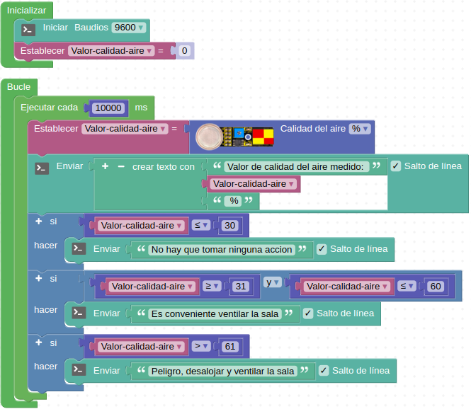

# A28-Sensor MQ-135
El MQ-135 dispone de una lámina de SnO2 como material sensible a los gases y basa su funcionamiento en que el SnO2  tiene baja conductividad eléctrica en el aire limpio. Su funcionamiento es muy sencillo, según aumente la cantidad de contaminantes en el aire también aumentará su conductividad eléctrica y viceversa.
El MQ-135 tiene una sensibilidad alta a la presencia de amoniaco, sulfuros, vapores de benceno, humo y otros gases nocivos para la salud. El módulo dispone de una resistencia ajustable que permite regular la sensibilidad del mismo.

En el [datasheet](https://www.electronicoscaldas.com/datasheet/MQ-135_Hanwei.pdf) del sensor tenemos un ábaco de curvas (Figura A28.1) que nos muestra las características típicas de sensibilidad del MQ-135 para varios gases. Las curvas se dan a una temperatura de 20ºC, una humedad del 65% bajo una concentración de O2 del 21% y una RL=20kΩ con:

* Ro: resistencia del sensor a 100 ppm de NH3 en aire limpio.
* Rs: resistencia del sensor a varias concentraciones de gases.

*Figura A28.1. Curvas sensibilidad MQ-135*

El sensor requiere para su funcionamiento un calentamiento previo de unos 30 segundos y cuando se utiliza por primera vez se recomienda que este sea de entre 8 y 12 horas para que el calor que se genera durante este tiempo queme los residuos del proceso de fabricación. No es recomendable tocar el sensor una vez conectado ya que puede quemar.

Los módulos MQ son sensibles a más de un gas y en diferentes proporciones por lo que no sirven para identificar la presencia de un gas especifico.

Dado que el sensor va a estar en ambientes con presencia de gases que pueden ser inflamables el mismo se encierra en una cápsula de dos capas de malla de acero inoxidable que asegura que el elemento calefactor interno no cause una explosión. Esta malla sirve también de filtro para las partículas en suspensión evitando que entren al interior de la cámara y que solamente penetren a ella los gases. El sistema calefactor se realiza mediante una bobina de níquel cromado que es la que se recubre del dióxido de estaño sensible a gases combustibles.

Su aspecto lo vemos en la Figura A28.2.

*Figura A28.2. Aspecto*

En el apartado de bloques de programación, se encuentra en "Sensores" (Figura A28.3).

*Figura A28.3. Bloques*

## **Práctica A28.1**
Vamos a medir la presencia de gases en el ambiente de una habitación.

* Mostrar en la consola mensajes relativos a la calidad del aire de una habitación en función de que se detecte un determinado nivel de presencia de gases en la misma. El bloque nos entrega la medida en % y vamos a estimar que si el valor medido está por debajo del 20% la calidad del aire es buena, si está entre e 21% y el 60% es aceptable y que si el porcentaje supera el 60% la calidad del aire es mala. Asociaremos a cada grupo de valores los mensajes de “No hay que tomar ninguna acción”, “Es conveniente ventilar la sala” y “Peligro, desalojar y ventilar la sala”. El programa lo tenemos en la Figura A28.4.

*Figura A28.4. Solución A28.1*

El aspecto de la consola con los datos recibidos lo vemos en la Figura A28.5.

*Figura A28.5. Consola de la actividad A28.1*

