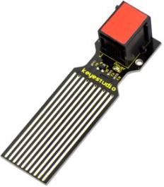
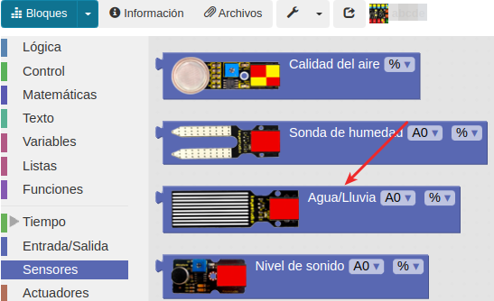
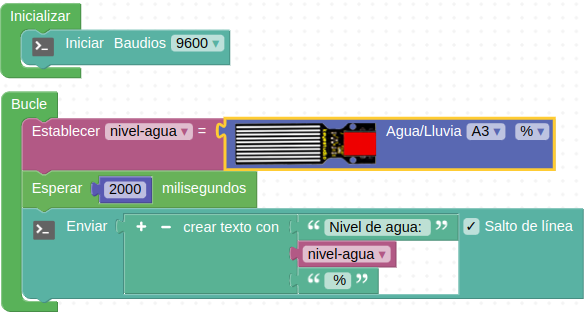
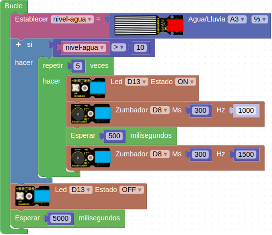

# A14-Detector de nivel agua
Este sensor está especialmente diseñado para identificar el nivel de agua y para detectar fugas de agua o detectar agua de lluvia. Es posible medir el nivel a través de una serie de pistas expuestas. Realiza una conversión directa y proporcional entre la cantidad de agua y la salida analógica. Su aspecto lo vemos en la Figura A14.1.

*Figura A14.1. Aspecto*

En el apartado de bloques de programación, se encuentra en "Sensores" (Figura A14.2).

*Figura A14.2. Bloques*

## **Práctica A14.1**
Vamos en primer lugar a leer los valores que da el sensor y mostrarlos por consola.

* Leer y mostrar los valores cuando el sensor está al aire y cuando se va introduciendo en el agua hasta llegar al máximo valor. El programa lo tenemos en la Figura A14.3.

*Figura A14.3. Solución A14.1*

## **Práctica A14.2**
En esta práctica vamos a realizar una alarma óptico-acústica que nos indique que tenemos una fuga de agua.

* Cuando el sensor de agua detecte un nivel del 10% se accionará la alarma de manera intermitente cada 5 segundos. El programa lo tenemos en la Figura A14.4.

*Figura A14.4. Solución A14.2*

