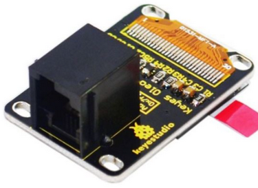
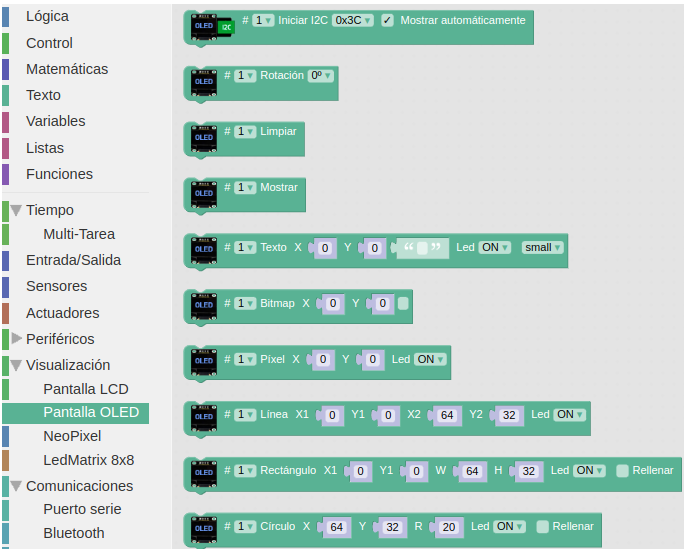
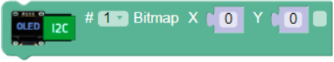
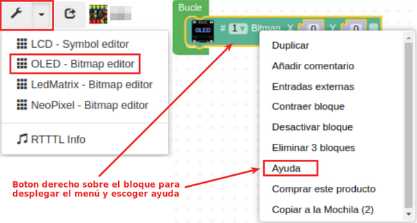
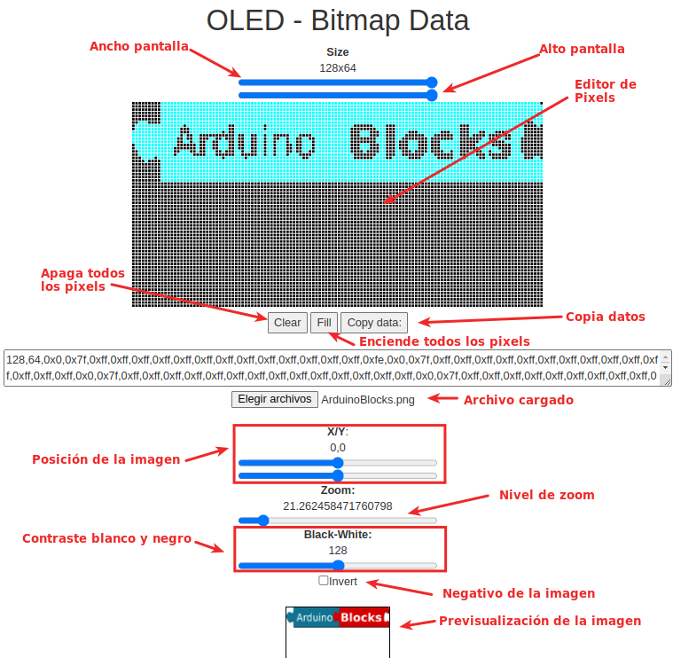
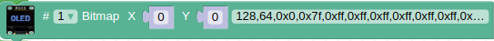
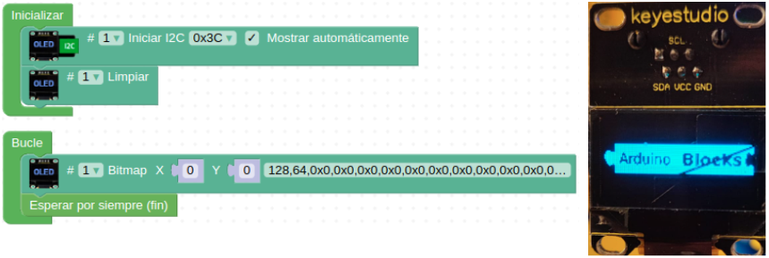
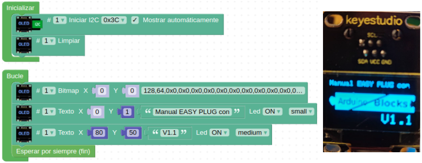

# A25-Pantalla gráfica OLED de 0.96" y 128x64 pixeles
OLED es la abreviatura de (Organic Light-Emitting Diode) o diodo emisor de luz orgánico. Se dice orgánico debido a una película de carbono que se encuentra en el interior del panel, detrás del cristal protector. Cuando se colocan varias películas orgánicas entre dos conductores se puede hacer que cada pixel se ilumine de forma individual, haciendo muy eficiente este tipo de pantallas. Es decir, una pantalla OLED emite luz brillante propia al pasar corriente eléctrica. La OLED Easy Plug es de tipo I2C. Su aspecto lo vemos en la Figura A25.1.

*Figura A25.1. Aspecto*

En el apartado de bloques de programación, se encuentra en "Visualización" y tiene su propio menú de bloques (Figura A25.2).

*Figura A25.2. Bloques*

Antes de realizar actividades con la pantalla OLED es necesario conocer las herramientas disponibles en ArduinoBlocks para el trabajo con gráficos. Para poder mostrar gráficos debemos generar un mapa de bits que indique que pixeles estarán apagados y cuales encendidos. ArduinoBlocks dispone de una herramienta visual (OLED - Bitmap Data) que nos permite generar fácilmente el código de los bitmaps y de un bloque que nos permite mostrarlos. El bloque para mostrar un bitmap es el de la figura A25.3.

*Figura A25.3. Bloque mostrar un bitmap*

A la herramienta OLED - Bitmap Data podemos acceder por cualquiera de los métodos que vemos en la Figura A25.4

*Figura A25.4. Acceso a OLED - Bitmap Data*

En la imagen de la Figura A25.5 vemos la pantalla OLED - Bitmap Data y la explicación de sus partes.

*Figura A25.5. Pantalla OLED - Bitmap Data*

En la Figura A25.6 tenemos el bloque de mostrar bitmap con los datos del logo de ArduinoBlocks copiados en el mismo.

*Figura A25.6. Bloque mostrar bitmap con datos*

## **Práctica A25.1**
Vamos a mostrar en una pantalla OLED un logotipo.

* Mostrar en una OLED el logotipo de ArduinoBlocks. El programa y el resultado en una OLED real lo tenemos en la Figura A25.7.

*Figura A25.7. Solución A25.1*

## **Práctica A25.2**
Vamos a mostrar en una pantalla OLED un logotipo y un texto.

*Mostrar en la pantalla OLED el mismo logotipo que en la práctica A25.1 situando en la parte superior el texto “Manual EASY PLUG con” en tamaño ‘Small’ y en la parte inferior el texto “V1.1”. El programa y el resultado en una OLED real lo tenemos en la Figura A25.8.

*Figura A25.8. Solución A25.2*

