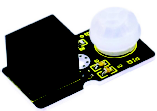
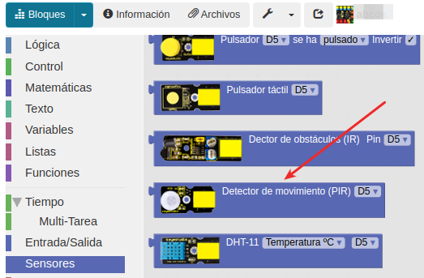
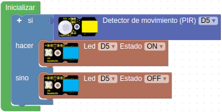
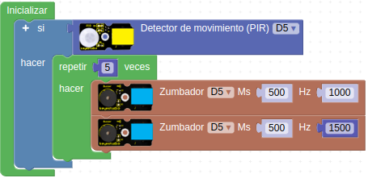

# A09- Sensor de presencia PIR
En esta práctica, el objetivo es conocer el sensor de movimiento, también llamado PIR. El sensor PIR es un sensor de movimiento, que tal y como dice su nombre puede detectar señales infrarrojas provenientes de una persona, animal u objeto en movimiento. El sensor tiene el aspecto de la Figura A09.1 y en el se basan las alarmas que detectan movimiento.

*Figura A09.1. Aspecto*

En el apartado de bloques de programación, se encuentra en "Sensores" (Figura A09.2).

*Figura A09.2. Bloques*

## **Práctica A09.1**
En esta práctica utilizaremos el sensor PIR y un LED.

* Si detecta movimiento que se encienda el LED sino que se apague. En la Figura A09.3 tenemos el programa.

*Figura A09.3. Solución A09.1*

## **Práctica A09.2**
En esta práctica reproduciremos una alarma. Así pues, utilizaremos el sensor PIR, y el zumbador pasivo.

* Si detecta movimiento que el zumbador emita un sonido similar a una alarma. Para ello, deberá emitir los dos tipos de sonido que se observan durante 500 milisegundos cada uno, repitiendo ciertas veces. En la Figura A09.4 tenemos el programa.

*Figura A09.4. Solución A09.2*

