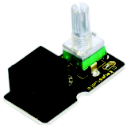
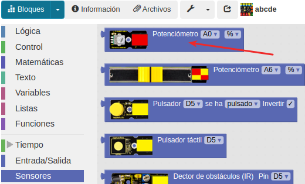
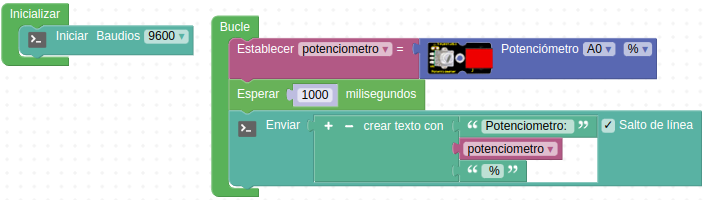
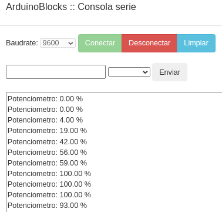
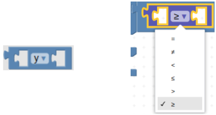
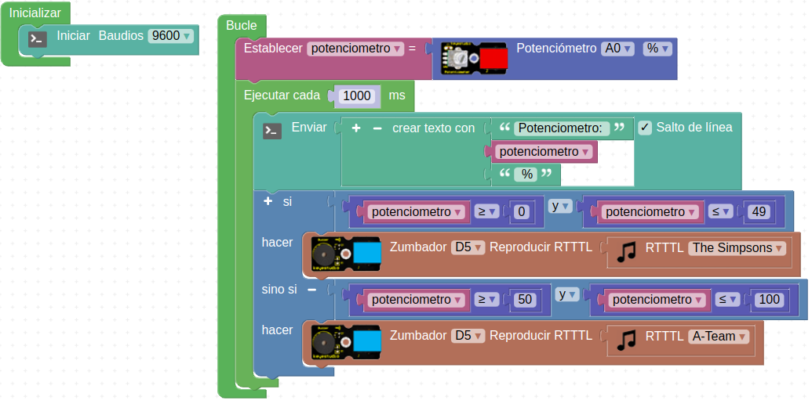
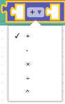
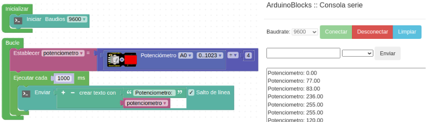
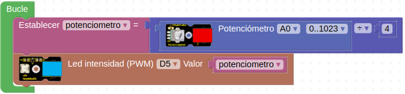

# A10-El potenciometro
En esta práctica el objetivo es conocer el potenciómetro. El potenciómetro es un sensor rotativo en un ángulo de 270º y es analógico. Su voltaje se puede subdividir en 1024 valores que también se pueden expresar en tanto por ciento. En la Figura A10.1 vemos su aspecto.

*Figura A10.1. Aspecto*

En el apartado de bloques de programación se encuentra en “Sensores” (Figura A10.2).

*Figura A10.2. Bloques*

## **Práctica A10.1**
En esta práctica conoceremos cómo funciona el potenciómetro. Los valores que se recogen pueden calcularse en porcentaje o en numeración desde 0 hasta 1023 (combinación binaria). En esta práctica observaremos los parámetros y el movimiento del potenciómetro a través de la consola.

Por tanto, crearemos una variable que se llame "potenciómetro" y la asociaremos al sensor potenciómetro.

* Que la consola muestre cada segundo cuál es el valor del potenciómetro. En la Figura A10.3 vemos el programa.

*Figura A10.3. Solución A10.1*

En la Figura A10.4 vemos los resultados que se obtienen en la consola.

*Figura A10.4. Consola A10.1*

## **Práctica A10.2**
Ahora que conocemos cómo averiguar el valor que entrega el potenciómetro lo programaremos combinando con un zumbador:

* Si el potenciómetro está entre 0 y 49% emitirá un sonido, en cambio, si está entre 50% y 100% emitirá otro sonido distinto.

Por tanto, ahora haremos uso de la función lógica "y" o “AND” y la combinaremos con el de signos de mayor y menor. Es decir, dos bloques que vemos en la Figura A10.5.

*Figura A10.5. Bloques AND y mayor o igual*

Vamos a programar el intervalo de 0 a 49% mediante una función AND y preguntando si potenciómetro es mayor o igual que 0 “Y” menor o igual que 49. Para el otro intervalo preguntamos si es mayor o igual que 50 “Y” menor o igual que 100.

En este programa (Figura A10.6) es interesante visualizar lo que ocurre por la consola, pues así podemos observar el cambio de porcentaje.

*Figura A10.6. Solución A10.2*

## **Práctica A10.3**
En esta tercera práctica utilizaremos el potenciómetro para regular la intensidad luminosa de un LED. Recordemos que en la práctica A02, estuvimos trabajando el PWM. En aquellas prácticas descubrimos que se medía su rango, entre los valores 0 y 255, es decir, un total de 256 valores.

A la vez, sabemos que el potenciómetro puede darnos el rango de valores de 0 a 100% o también de 0 a 1023. Escogeremos esta última condición y crearemos una variable de nombre potenciómetro. Pero esta vez dividiremos los valores que recoja entre 4, ya que si dividimos 1023 entre 4, nos sale 255. De esta forma podemos ver la similitud: 255 (máxima intensidad del LED) y 1023 (máximo valor del potenciómetro).

Empezamos creando la variable, para ello debemos ir al apartado de "Matemáticas" y seleccionar el bloque de operadores. Éste bloque tiene un desplegable (Figura A10.7) y debemos escoger la división para nuestro caso.

*Figura A10.7. Operadores matemáticos*

La variable potencimetro debe quedarnos como vemos en la Figura A10.8.

*Figura A10.8. Creación de la variable*

Podemos comprobar como cambia esta nueva variable cuando movemos el potenciómetro, enviando valores a la consola, tal y como observar en la Figura A10.9.

*Figura A10.9. Visualización en consola del cambio en el potenciómetro*

* Que a medida que vamos "girando" el potenciómetro, la intensidad del LED vaya subiendo. Para hacer este programa vamos a utilizar el bloque “Led intensidad (PWM)” al que asignaremos el valor de la variable potenciómetro. El programa lo vemos en la Figura A10.10.

*Figura A10.3. Solución A10.10*

