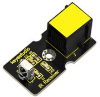
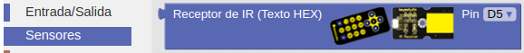
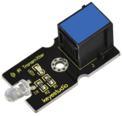
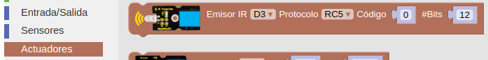
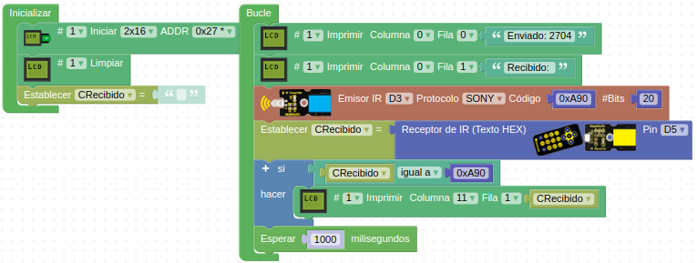

# A32-Módulos receptor y emisor de infrarrojos IR

### Receptor IR
El receptor de infrarrojos es un módulo con funciones de recepción, amplificación y demodulación  para que entregue una señal digital demodulada en frecuencia de 38KHz. Normalmente se utiliza junto con el módulo transmisor IR o algún mando a distancia universal o un mando a distancia como el del [enlace](https://wiki.keyestudio.com/Ks0088_New_Infrared_IR_Wireless_Remote_Control_Module_Kits_for_Arduino).

Su aspecto lo vemos en la Figura A32.1.

*Figura A32.1. Aspecto receptor IR*

En el apartado de bloques de programación, se encuentra en "Sensores" (Figura A32.2).

*Figura A32.2. Bloque receptor IR*

### Emisor IR
Un transmisor de infrarrojos es simplemente un diodo LED que genera luz infrarroja. Por ejemplo, en un control remoto infrarrojo al presionar un botón se envía una señal al LED IR, que convierte la señal en un haz de luz infrarroja. El dispositivo receptor detecta la luz con un fotodiodo IR y la convierte en una señal eléctrica a través de un circuito integrado, controlando así sus acciones.

Los transmisores infrarrojos se utilizan ampliamente como medio de comunicación inalámbrica mediante controles remotos para televisores y otros dispositivos electrónicos.

Este módulo transmisor IR se empareja con el módulo receptor IR y sus principales características son:

- Frecuencia central infrarroja: 850nm a 940nm
- Ángulo de emisión infrarroja: 20 grados
- Distancia de emisión infrarroja: 1.3m (5V 38Khz)

Su aspecto lo vemos en la Figura A32.3.

*Figura A32.3. Aspecto emisor IR*

En el apartado de bloques de programación, se encuentra en "Actuadores" (Figura A32.4).

*Figura A32.4. Bloque emisor IR*

El bloque permite seleccionar el protocolo al que pertenece el código a enviar que pongamos en el campo correspondiente y solamente permite conectar el módulo al pin D3.

Para obtener la información de un mando IR cualquiera y decodificar el protocolo, número de bits y código de cada tecla podemos seguir este [tutorial de Adafruit](https://learn.adafruit.com/using-an-infrared-library/) sobre la utilización de su librería de IR para el IDE de Arduino.

## **Práctica A32.1**
Vamos a enviar un código desde el módulo emisor, lo visualizamos en la LCD, lo recibimos en el receptor y lo visualizamos también en la LCD.

* Enviar el código Sony 0xA90 (2704 en decimal) desde el módulo emisor y comprobar si  el módulo receptor lo recibe mostrando los resultados en una pantalla LCD. El programa lo tenemos en la Figura A32.5.

*Figura A32.5. Solución A32.1*

