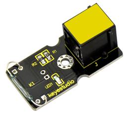
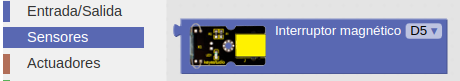
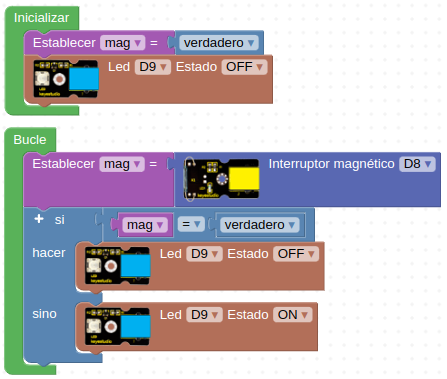

# A34-Módulo relé Reed
Un interruptor de lengüeta o reed switch o relé reed es un interruptor eléctrico activado por un campo magnético. Cuando los contactos están normalmente abiertos se cierran en la presencia de un campo magnético; cuando están normalmente cerrados se abren en presencia de un campo magnético.

Este módulo incluye un relé reed que cierra sus contactos cuando se expone a un campo magnético y están abiertos si no hay campo magnético presente. es un pequeño dispositivo llamado interruptor de láminas en el módulo. Esto lo hace útil para montarlo por ejemplo en una puerta con propósito de activar una alarma o como interruptor. Sus principales características son:

* Voltaje de funcionamiento: 3,3 V a 5 V DC
* Corriente de trabajo: ≥20mA
* Temperatura de trabajo: -10 ℃ a ＋50 ℃
* Distancia de detección: ≤10 mm

Su aspecto lo vemos en la Figura A34.1.

*Figura A34.1. Aspecto*

En el apartado de bloques de programación, se encuentra en "Sensores" (Figura A34.2).

*Figura A34.2. Bloques*

## **Práctica A34.1**
Vamos a montar un sistema que cuando acerquemos un imán se encienda un diodo LED.

* Implementar un programa que haga funcionar al relé reed como detector magnético en una supuesta puerta de un armario. Cuando la puerta está cerrada se detecta el campo magnético y el diodo LED está apagado y cuando se abre este debe apagarse. El programa lo tenemos en la Figura A34.3.

*Figura A34.3. Solución A34.1*

