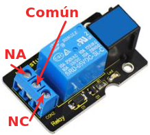
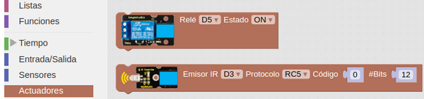
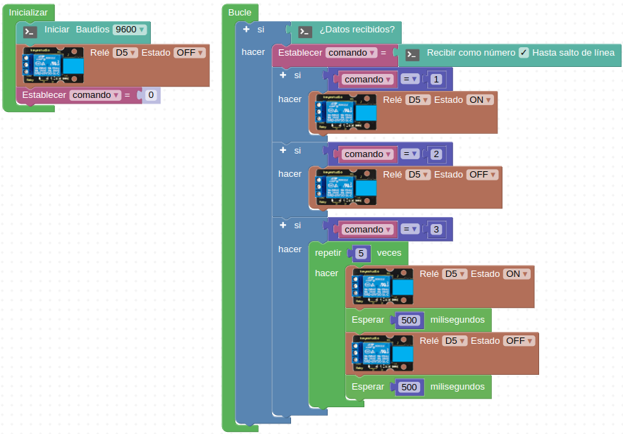
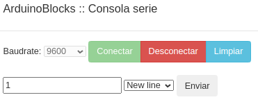

# A26-Módulo relé
Un relé es básicamente un interruptor mecánico controlado eléctricamente de forma que a través de una pequeña tensión y corriente se puede controlar la apertura y cierre de sus contactos mecánicos donde se puede trabajar con tensiones y corrientes elevadas. El módulo incluye un LED que nos indica si el relé está accionado cuando se enciende.

El modelo de relé que lleva este módulo es el SRD-05VDC-SL-C que presenta las siguientes características:

* En AC (corriente alterna): 250Vac / 10A
* En DC (corriente continua): 30Vdc / 10A o bien 250Vdc / 1A
* Tensión de la bobina: 5V, compatible con señales TTL para su excitación
* Contactos: 3 pines, 1 Común + 1 contacto NA (normalmente abierto) + 1 contacto NC (normalmente cerrado)

Esquemáticamente un relé de este tipo se puede parecer a la imagen de la Figura A26.1.

*Figura A26.1. Aspecto esquemático de un relé*
*Fuente: [wikipedia](https://es.wikipedia.org/wiki/Relé)*

En el enlace podemos ver una [animación del funcionamiento de un relé](https://es.wikipedia.org/wiki/Relé#/media/Archivo:Relay_principle_horizontal_new.gif)

Su aspecto lo vemos en la Figura A26.2.

*Figura A26.2. Aspecto*

En el apartado de bloques de programación, se encuentra en "Actuadores" (Figura A26.3).

*Figura A26.3. Bloques*

## **Práctica A26.1**
Vamos a controlar el accionamiento de un relé desde nuestro ordenador a través de la consola serie.

* Conectar un módulo relé y vamos a hacer que funcione a través de los siguientes comandos que enviaremos desde la consola: 1 –> ON, 2→ OFF y 3 → Conmutar ON/OFF a 500 ms. El programa lo tenemos en la Figura A26.4.

*Figura A26.4. Solución A26.1*

El aspecto de la consola lista para enviar el comando de encendido lo vemos en la Figura A26.5.

*Figura A26.5. Consola de la actividad A26.1*

