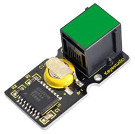
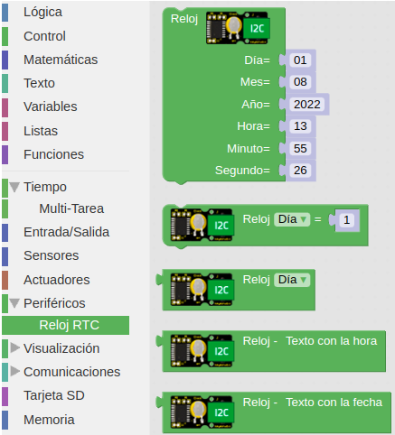
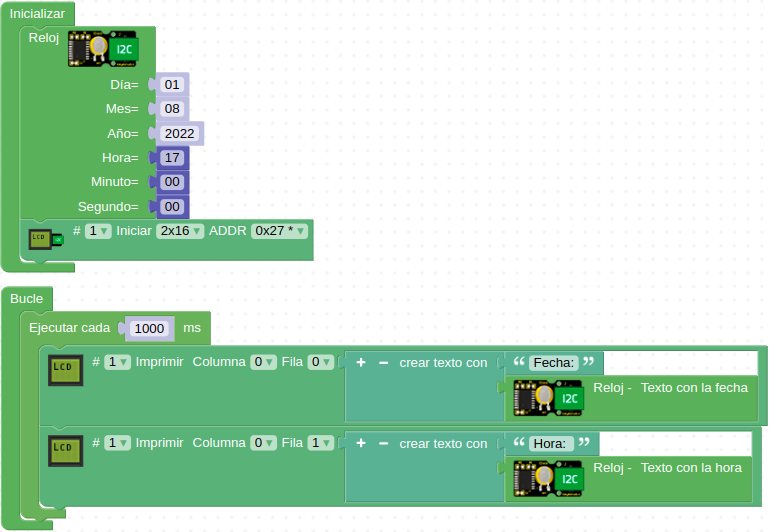
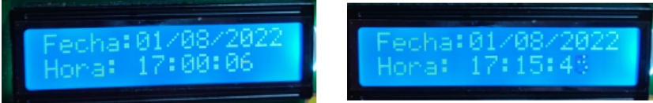

# A29-Módulo RTC DS3231
El circuito integrado DS3231 en el que se basa el módulo es un reloj I2C en tiempo real (RTC de Real Time Clock) muy preciso con un oscilador de cristal compensado con la temperatura que nos devuelve la hora y la fecha. El dispositivo incorpora una batería encargada de mantener la hora y fechas ajustadas cuando se interrumpe la alimentación principal al mismo. Su aspecto lo vemos en la Figura A29.1.

*Figura A29.1. Aspecto*

En el apartado de bloques de programación, se encuentra en "Periféricos" y tiene sus propios bloques (Figura A29.2).

*Figura A29.2. Bloques*

## **Práctica A29.1**
Ajuste de fecha y hora del módulo RTC DS3231

* Ajustar la fecha y hora actuales o las deseadas en el RTC y mostrar sus valores leídos del dispositivo.

En esta ocasión vamos a utilizar dos dispositivos I2C por lo que se hace necesario el uso del Hub I2C para conectar ambos a la única entrada de que dispone la placa.

Lógicamente el ajuste solamente lo debemos realizar una vez y a partir de ahí no poner el bloque de configuración en nuestro programa y que sea la batería la encargada de mantener la fecha y la hora. El valor que lee el bloque para la fecha y la hora por defecto es el del ordenador.
 
El programa lo tenemos en la Figura A29.3.

*Figura A29.3. Solución A29.1*

El aspecto de la LCD justo después de subir el programa y transcurridos unos minutos sin alimentar tras los cuales volvemos a conectar el sistema lo vemos en la Figura A29.4.

*Figura A29.4. Consola de la actividad A29.1*

