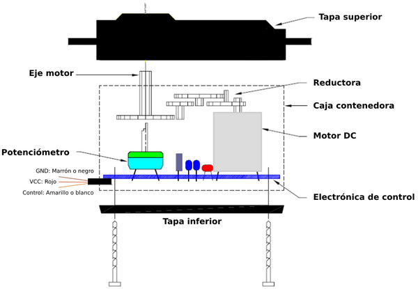
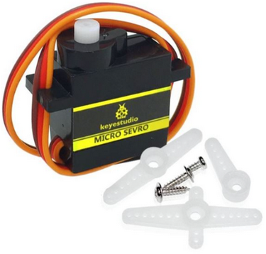
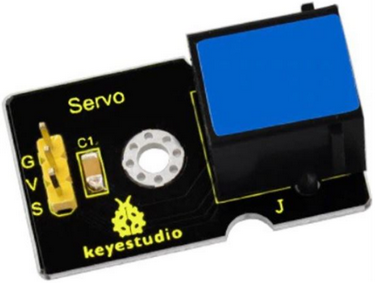
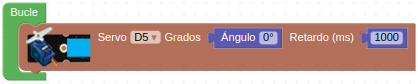
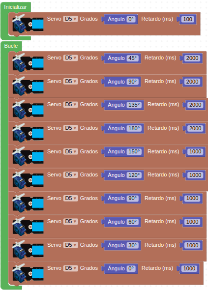

# A23-Servomotor
Un servomotor o abreviado servo es un motor especial que puede posicionar su eje en un ángulo determinado y lo puede mantener en esta posición. Los servos estándar suelen girar 180º, pero es habitual encontrar servos que giran 90º y otros 360º, que son los conocidos como servos de rotación continua.  En el interior del mismo están ubicados tanto la electrónica de control como los engranajes reductores que a su vez pueden llevar o no topes físicos que marquen el ángulo de giro. Para su funcionamiento sólo necesita alimentación ser alimentados (conexiones GND y VCC o 5V) y una señal de control.

El interior de un servo lo vamos esquematizado en la Figura A23.1.

*Figura A23.1. Esquema de un servomotor*

Su aspecto lo vemos en la Figura A23.2.

*Figura A23.2. Aspecto*

Veamos su principio básico de funcionamiento: La electrónica de control del servomotor tiene un circuito de referencia incorporado que emite la señal de referencia, que es un ciclo de 20 ms con un ancho de pulso de 1,5 ms. Se compara la tensión de control recibida con la de referencia y se genera una diferencia de tensión. El circuito de control en la placa decidirá la dirección de rotación en consecuencia y accionará el motor. El sistema de engranajes o reductora convierten el giro del motor en un par de fuerza a través del eje. El sensor detecta que se ha alcanzado la posición enviada  de acuerdo con la señal de retroalimentación. Cuando la diferencia de tensión existe el motor gira y cuando la diferencia se reduce a cero, el motor se detiene. Normalmente, el ángulo de rotación es de 0 a 180 grados.

El servomotor viene con un conector hembra de tres pines para tres cables de conexión, que se distinguen por los colores marrón, rojo y naranja (diferentes marcas pueden tener diferentes colores).

El ángulo de rotación del servomotor se controla regulando el ciclo de trabajo de la señal PWM cuyo estándar es de 20 ms (50 Hz).

Para poder conectar un servomotor a la placa Easy Plug debemos utilizar el adaptador que vemos en la Figura A23.3.

*Figura A23.3. Adaptador servo de modular a Easy Plug*

<b> Hay que tener mucho cuidado de posicionar el conector del servo en los tres pines macho del adaptador para hacerlo en el orden correcto (el conector es reversible) o seguramente romperemos algo de manera irreversible. </b>

En el apartado de bloques de programación, se encuentra en "Actuadores" (Figura A23.4).

*Figura A23.4. Bloques*

Para controlar el servomotor, indicamos los grados de rotación (Ángulo de giro) que queremos y el tiempo de retardo, o tiempo que tarda en ir de una posición a otra.

## **Práctica A23.1**
Vamos a posicionar el servo en su ángulo de 0º u origen. Esta práctica es siempre una buena idea cuando no sabemos cual es la posición 0º del servo.

* Programar, por primera vez el ángulo a 0º para descubrir el punto de origen y a partir de aquí montar alguna pala de las que vienen con el servo para poder visualizar la rotación del eje. El programa lo tenemos en la Figura A23.5.

*Figura A23.5. Solución A23.1*

## **Práctica A23.2**
Una vez averiguada la posición inicial del servo vamos a hacer que este se mueva con la siguiente secuencia de ángulos: 0, 45, 90, 135, 180, 150, 120, 90, 60, 30, 0.

* Hacer que el servo gire de 0 a 180 en incrementos de 45º con un retardo de 2 segundos y de 180 a cero con un decremento de 30º y un retardo de un segundo. El programa lo tenemos en la Figura A23.6.

*Figura A23.6. Solución A23.2*

