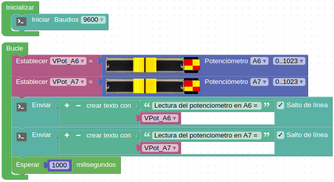

# A31-Potenciómetro deslizante
El potenciómetro deslizante o slide es una resistencia variable a la que podemos cambiar su valor deslizando un cursor por una resistencia a lo largo de toda su longitud. Muy característico de mesas de mezclas de audio. En realidad se trata de un potenciómetro doble montados de forma que cuando uno aumenta su resistencia el otro la disminuya y viceversa. Su aspecto lo vemos en la Figura A31.1.

*Figura A31.1. Aspecto*

El color con el que viene marcado nos indica que es un sensor analógico pero en realidad funciona con dos pines analógicos y el único conector de la placa que los tiene es el marcado en rojo y amarillo (D6 y D7) que son los únicos pines que deja conectar el bloque de ArduinoBlocks.

En realidad se trata de una salida analógica dual que nos entrega una señal analógica variable entre 0 y VCC, es decir valores entre 0 y 1023 (o 0 y 100%).  La suma de los dos valores analógicos que da el potenciómetro es 1023.

Hay posibilidad de soldar dos conectores de 3 pines de paso 2,54 mm en el módulo que permite su conexión con otros dispositivos.

En el apartado de bloques de programación, se encuentra en "Sensores" (Figura A31.2).

*Figura A31.2. Bloques*

## **Práctica A31.1**
Vamos a medir las variaciones de las resistencias del potenciómetro.

* Mostrar en la consola el valor como lectura analógica de 0 a 1023 de cada una de las resistencia  del potenciómetro deslizante. El programa lo tenemos en la Figura A31.3.

*Figura A31.3. Solución A31.1*

## **Práctica A31.2**
Controlar un servo 0-180º mediante el potenciómetro deslizante.

* Realizar el mapeo de una variable que mide las variaciones de resistencia de un potenciómetro deslizante de forma que haga girar a un servo entre 0 y 180º en función del valor de la resistencia del mismo. El programa lo tenemos en la Figura A31.4.

*Figura A31.4. Solución A31.2*
