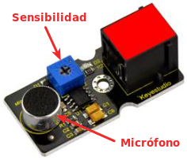
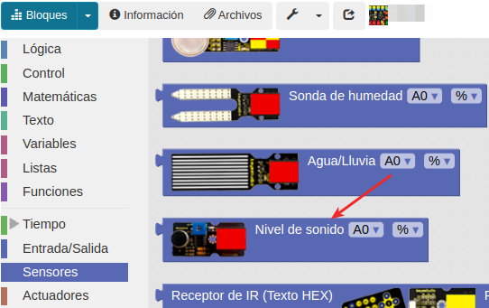
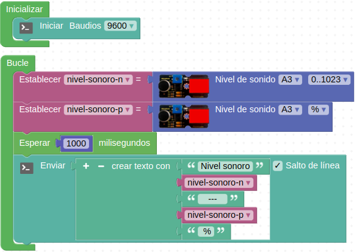
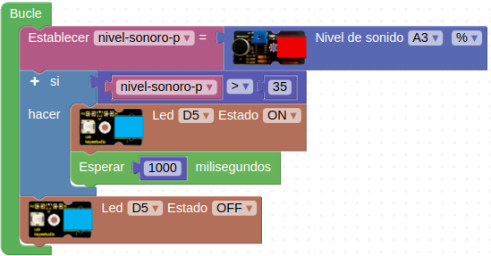

# A13-Sensor analógico de sonido
El sensor de sonido está dotado de un micrófono capaz de detectar el volumen de ruido ambiental. Se puede usar para hacer circuitos tipo interruptor operado por voz. Se trata de un sensor de tipo analógico.

La sensibilidad del sonido se puede ajustar mediante el potenciómetro. Su aspecto lo vemos en la Figura A13.1.

*Figura A13.1. Aspecto*

En el apartado de bloques de programación, se encuentra en "Sensores" (Figura A13.2).

*Figura A13.2. Bloques*

## **Práctica A13.1**
Lo primero que vamos a hacer es leer la salida del sensor y comprobar como cambia su sensibilidad al mover el potenciómetro.

* Lectura del sensor de sonido y ajuste de la sensibilidad mostrando los datos por consola tanto en valor numérico como en porcentaje. El programa lo tenemos en la Figura A13.3.

*Figura A13.3. Solución A13.1*

## **Práctica A13.2**
Usaremos el sensor de sonido como un interruptor.

* Cuando el nivel sonoro supere el 35% que se encienda un LED rojo. El programa lo tenemos en la Figura A13.4.

*Figura A13.4. Solución A13.2*

