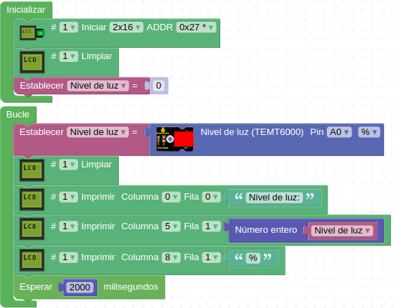

# A21-Sensor de luz ambiental TEMT6000
El sensor de luz ambiental TEMT6000 es un sensor analógico con mayor sensibilidad que la LDR. En teoría el TEMT6000 está adaptado según la sensibilidad del ojo humano. Es posible que con niveles de poca luz no sea muy sensible, y, al igual que el ojo humano, no reacciona bien a la luz infrarroja o ultravioleta. Su aspecto lo vemos en la Figura A21.1.

*Figura A21.1. Aspecto*

En el apartado de bloques de programación, se encuentra en "Sensores" (Figura A21.2).

*Figura A21.2. Bloques*

## **Práctica A21.1**
Vamos a medir el nivel de luz ambiente de una habitación.

* Mostrar en una LCD el nivel de luz ambiental de una habitación expresado en %. El programa lo tenemos en la Figura A21.3.

*Figura A21.3. Solución A21.1*

