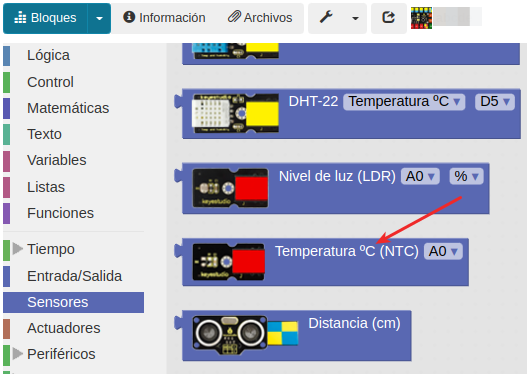
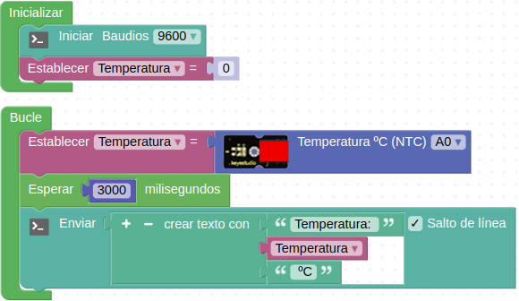
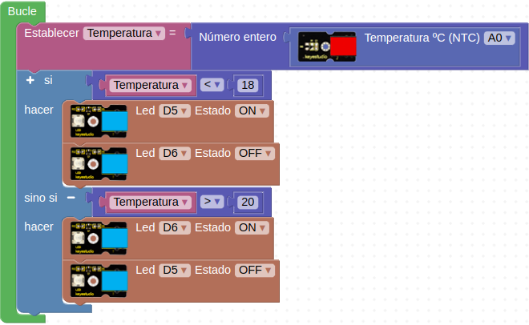

# A12-Sensor analógico de temperatura, el termistor
Un termistor es una resistencia cuyo valor depende la temperatura y es por tanto un sensor analógico que sirve para detectar temperatura. El sensor analógico de temperatura está basado en un termistor y nos va a servir por tanto para medir la temperatura. Su aspecto lo vemos en la Figura A12.1.

*Figura A12.1. Aspecto*

En el apartado de bloques de programación, se encuentra en "Sensores" (Figura A12.2).

*Figura A12.2. Bloques*

## **Práctica A12.1**

* Enviar a la consola serie la medida de temperatura cada tres segundos. El programa lo tenemos en la Figura A12.3.

*Figura A12.3. Solución A12.1*

## **Práctica A12.2**

* Simular un termostato de forma que si la temperatura está por debajo de un valor de 18 ºC se encienda un LED que indica que se activa la calefacción y si está por encima de 20 ºC que se encienda un LED verde, se apague el rojo indicando que la estancia está a una temperatura superior a los 18 ºC. El programa lo tenemos en la Figura A12.4.

*Figura A12.4. Solución A12.2*

