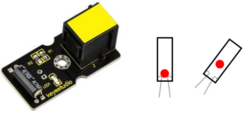
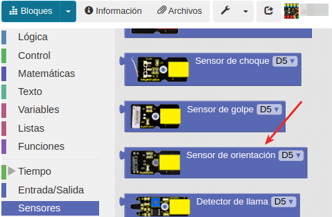
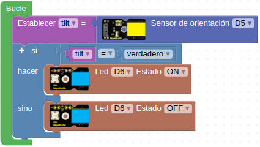

# A18-Sensor de inclinación (tilt)
El interruptor de inclinación es el equivalente a un botón y se utiliza como entrada digital. Dentro del interruptor de inclinación hay una bolita metálica que hace contacto con los pines cuando el sensor está en posición vertical. Inclinando el sensor la bolita no toca los contactos, por lo que deja el circuito abierto. La idea es que cuando el sensor está horizontal está abierto y cuando se inclina se cierra, lo que permite detectar una determinada orientación. Su aspecto y principio de funcionamiento lo vemos en la Figura A18.1.

*Figura A18.1. Aspecto*

En el apartado de bloques de programación, se encuentra en "Sensores" (Figura A18.2).

*Figura A18.2. Bloques*

## **Práctica A18.1**
Vamos a detectar la posición no vertical del sensor de orientación.

* Encender un LED cuando el sensor de orientación no esté en posición vertical. El programa lo tenemos en la Figura A18.3.

*Figura A18.3. Solución A18.1*

