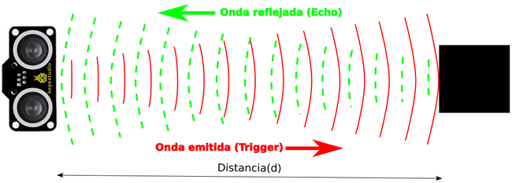
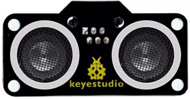
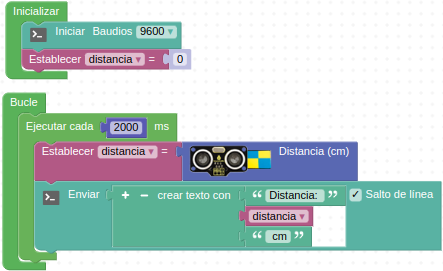

# <FONT COLOR=#8B008B>A24-Sensor de Ultrasonido SR01 V2</font>
Los sensores ultrasónicos utilizan un sonar para determinar la distancia desde el sensor al objeto. Este módulo utiliza un chip CS100A que puede medir distancias entre 4 cm y 300 cm siendo la medida precisa y estable. El módulo incluye el transmisor y el receptor ultrasónicos y su circuito de control. El dispositivo debe conectarse a dos pines, por lo que utilizaremos el conector etiquetado con D3 y D4. Esto se debe a que para el funcionamiento del sensor necesita dos pines, uno para emitir el ultrasonido (Trigger) y otro para recibirlo (Echo).
El principio de funcionamiento es el de la Figura A24.1.

<center>



*Figura A24.1. Principio de funcionamiento del sensor*

</center>

El sensor lo que hace es medir el tiempo (t) en microsegundos que tarda en recibir el eco del sonido emitido y como la velocidad (v) es conocida, se trata de la velocidad del sonido, que es de 340 m/s o 0.034 cm/us, la distancia vendrá dada por la siguiente ecuación:

<center>

$d=v \cdot t=0.034(\dfrac{cm}{us})\cdot t(us)=0.034 \cdot t(cm)$

</center>

Aunque nosotros no debemos preocuparnos por esto puesto que el bloque ya no devuelve esta distancia medida en cm.

Su aspecto lo vemos en la Figura A24.2.

<center>



*Figura A24.2. Aspecto*

</center>

En el apartado de bloques de programación, se encuentra en "Sensores" (Figura A24.3).

<center>


*Figura A24.3. Bloques*

</center>

## <FONT COLOR=#007575>**Práctica A24.1**</font>
Vamos a medir la distancia con el sensor de ultrasonidos y mostrar el resultado en una LCD.

* Mostrar en una LCD la distancia que nos devuelve el sensor de ultrasonidos al poner frente al mismo un objeto a diferentes distancias. El programa lo tenemos en la Figura A24.4.

<center>


*Figura A24.4. Solución A24.1*

</center>

## <FONT COLOR=#007575>**Práctica A24.2**</font>
Vamos a medir la distancia con el sensor de ultrasonidos y mostrar el resultado en la consola.

* Mostrar por consola la velocidad medida por el sensor de ultrasonidos enviando un dato cada dos segundos. El programa lo tenemos en la Figura A24.5.

<center>



*Figura A24.5. Solución A24.2*

</center>

# <FONT COLOR=#8B008B>xxx</font>
## <FONT COLOR=#007575>**xxx**</font>
### <FONT COLOR=#AA0000>xxx</font>

Profundidad directorios:
* Imagenes en index: (./img/…..)
* Archivo: (directorio/nombre-archivo) o (../directorio/nombre-archivo)
* Enlace interno: (directorio/nombre-archivo)

insertar bloque de código:
```
sudo do-release-upgrade
```

<center>


*Figura A01.8. Encender y apagar dos LEDs*

</center>