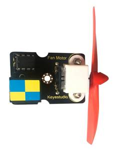
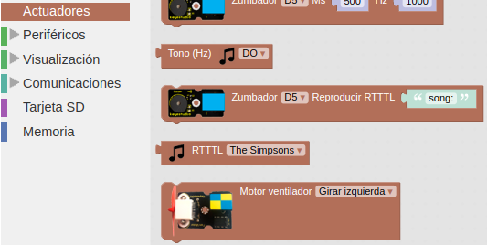
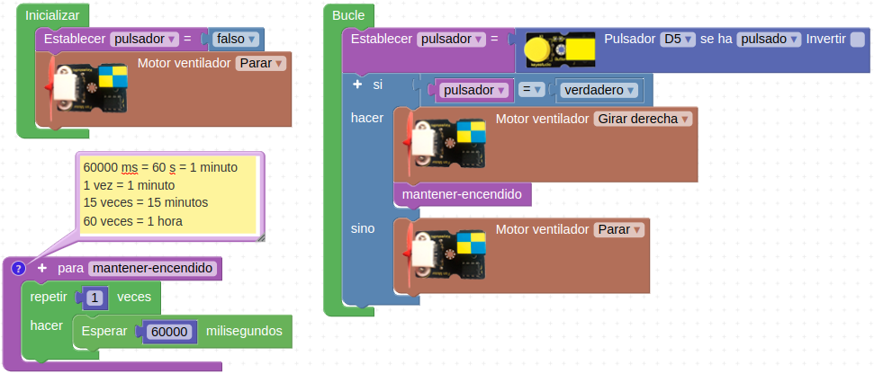

# A33-Módulo ventilador L9110
El módulo se componen de un motor de corriente continua a cuyo eje se puede aplicar una pequeña hélice que se puede usar como mini ventilador o como hélice en si misma. El módulo incorpora el controlador L9110 para poder seleccionar el sentido de giro. Su aspecto lo vemos en la Figura A33.1.

*Figura A33.1. Aspecto*

En el apartado de bloques de programación, se encuentra en "Actuadores" (Figura A33.2).

*Figura A33.2. Bloques*

## **Práctica A33.1**
Vamos a hacer que el motor gire a derechas y se detenga transcurrido un tiempo que prefijamos a través de una función creada a tal efecto.

* Implementar un ventilador que se acciona mediante un pulsador y que se mantiene en funcionamiento durante el tiempo que prefijemos. El programa lo tenemos en la Figura A33.3.

*Figura A33.3. Solución A33.1*

## **Práctica A33.2 - Propuesta**
Hacer que el motor gire en los dos sentidos para crear un ventilador de techo con posiciones de verano e invierno. El efecto ventilador verano e invierno se basa en lo siguiente: el funcionamiento más habitual de un ventilador de techo es impulsar el aire hacia abajo, directamente por debajo de él girando en sentido horario. Si queremos mover el aire caliente próximo al techo el ventilador debe girar en sentido contrario a las agujas del reloj, es decir, impulsando el aire hacia arriba y succionando por su parte inferior. De forma que el aire caliente se desplaza lateralmente, baja por las paredes hacia el suelo y vuelve a subir por el centro del ventilador.

* Implementar un ventilador que podamos configurar el modo de funcionamiento como modo verano y modo invierno pulsador.
